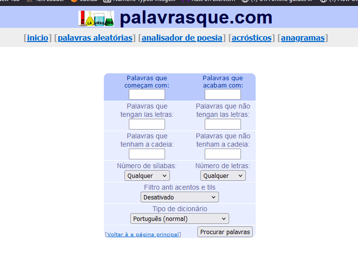

# CTF Classical Encryption

Começámos por ver quantos caracteres diferentes é que o texto tinha (caracteres sublinhados a negrito correspondem aos que estão presentes na flag):

\[  
**\]**  
%  
:  
^  
\~  
**/**  
(  
**)**  
\=  
\-  
**\+**  
.  
**\_**  
**\<**  
\>  
**;**  
&  
\*  
**?**  
\!  
|  
\#  
**@**  
**$**

Verificamos que o cipher tem 25 caracteres diferentes, mas o alfabeto tem 26… por isso colocamos a hipótese: cada símbolo corresponde a uma letra diferente e há uma letra que não é usada?

Notamos também que a flag só tem **estes caracteres**:  
\_  
$  
\+  
&  
\]  
?  
/  
\<  
(  
\~  
@  
)  
;

De forma a realizar a decifração, vamos fazer uma análise de frequência sobre o cipher. Para isso, usámos o mesmo programa de Python do Logbook anterior, apenas modificando o ficheiro que é lido, para obter os caracteres mais comuns, assim como os digramas e trigramas:

Recorremos aos seguintes recursos para saber a frequência dos digramas, trigramas, letras e palavras: 

[https://www.linguateca.pt/acesso/ordenador.php](https://www.linguateca.pt/acesso/ordenador.php) (lista de palavras mais comuns)

[https://www.mat.uc.pt/\~pedro/cientificos/Cripto/CISUC-TR200803.pdf](https://www.mat.uc.pt/~pedro/cientificos/Cripto/CISUC-TR200803.pdf)

Com um autor em comum ao anterior, este estudo foi feito com um número maior de trigramas e digramas:

[https://www.mat.uc.pt/\~pedro/lectivos/CodigosCriptografia1011/interTIC07pqap.pdf](https://www.mat.uc.pt/~pedro/lectivos/CodigosCriptografia1011/interTIC07pqap.pdf)

Na página da wikipédia:

[https://pt.wikipedia.org/wiki/Frequ%C3%AAncia\_de\_letras](https://pt.wikipedia.org/wiki/Frequ%C3%AAncia_de_letras)

Após fazer muitas substituições, estas e muitas mais, tentando sempre analisar o ficheiro a ver se havia alguma palavra que pudéssemos encontrar e que nos guiaria a decifrar alguns caracteres, não encontrámos nada:

Também tentámos usar sites como estes com a finalidade de encontrar palavras que se encaixassem neste contexto, mas também não conseguimos obter nada de significativo:

[https://www.palavrasque.com/pesquisar.php?i=\&f=\&tv=4\&button=Procurar+palavras\&ms=\&mns=\&m=\&mn=\&fs=0\&fnl=0\&fa=0\&d=0](https://www.palavrasque.com/pesquisar.php?i=&f=&tv=4&button=Procurar+palavras&ms=&mns=&m=&mn=&fs=0&fnl=0&fa=0&d=0)

[https://www.palavras.net/search.php?f=d](https://www.palavras.net/search.php?f=d)

Como neste momento já estávamos um bastante desorientados, após tentativas que não davam a lado nenhum, além de que não tínhamos 100% a certeza se o texto era em inglês ou em português, não tínhamos 100% a certeza se o texto tinha espaços (outra coisa também bastante peculiar foi que o digrama mais frequente correspondia também ao trigrama mais frequente então começámos a imaginar que podia ser uma parte final de alguma palavra com um espaço a seguir, ou então uma palavra de duas letras que seria sempre seguida de um espaço), não tínhamos conseguido notar nenhuma palavra formada que nos indicasse que estávamos a ir na direção certa.

Face a estas dúvidas todas nós decidimos testar isto tudo para inglês e português, tendo em consideração que, independentemente da existência de espaços, este processo seria demasiado demorado. Pensamos então se o suposto seria fazer uma ferramenta automática que, recebendo a frequência das palavras e uma lista de todas as palavras de uma língua, consiga ir, progressivamente, decifrando e tentando os trigramas, diagramas, letras,… a ver se conseguia formar palavras pouco a pouco e essencialmente fazer este trabalho manual automaticamente. Porque bem lá no fundo o método passa bastante por tentativa e erro e o estado de sucesso/progresso que é a formação de palavras pode ser detetado facilmente por um programa ao analisar se conseguiu formar algumas palavras novas.

Ora, estar a fazer um destes programas de forma otimizada parece uma tarefa bastante complexa e longa. Lembramo-nos, então, que em muitos outros CTFs usamos programas que encontramos no GitHub (como por exemplo, o “Proof of Concept” para uma vulnerabilidade…), ou seja, quase que “vale tudo”, e que quase de certeza absoluta não fomos os primeiros a ter a ideia para este programa. 

Fomos, então, à procura, até que encontrámos o seguinte site que consegue desencriptar texto escrito em português que foi encriptado ao usar substituição monoalfabética:

[https://www.dcode.fr/monoalphabetic-substitution](https://www.dcode.fr/monoalphabetic-substitution)

No entanto, o site aceitava apenas texto encriptado com caracteres entre A-Z (só letras maiúsculas). Decidimos, então, usar o script de Python que já tínhamos usado anteriormente para ir tentando substituir alguns caracteres, para converter os caracteres especiais em letras maiúsculas.

Convertendo respetivamente:

* \[\]€:^\~/()=-+.\_\<\>;&\*?\!|\#@$

Em:

* ABCDEFGHIJKLMNOPQRSTUVWXYZ

Deu-nos o texto:

* DBKKMRKUPBQBKQBBNOMNXARARSRSMAXBNMKOMNZAMNXMKUPBXBSMDMKXMRNOBVNTRXHRABZOABYBDMAXRIMLQRDMJVOVRVNQVOMPBNXABXRNXMUPBRKRPXMAVQRQBKOMNXAMJRSZRRKVXPRORMQBDMVKQBABZMAORQMMBZBOXVIMQBKBZPARNOROMSZMAORKQMBZBAOVXMBQRDMJVOVRMHBJVOMDXBAMMNQBKBZPVRMNMIMDABKVQBNXBQRZPRXBSRJRZMAZBKBAARNMZMVMNXBSRXRORQMDBJRZPBAAVJHRZPRXBSRJXBORSRKMRXBNXRQMNRMZBLIVXVSRKKBZPNQMRNPNOVRARSZMNXBKMZVOVRVKRKSBKSRKZMNXBKVNQVORARSUPBMKABCBJQBKQVKDRARARSARZRQRKQBSBXARJHRQMARKMCABMHBJVOMDXBAMUPBZMVRXVNZVQMDMAIRAVMKCRJRKMDVJMXMOMNKBZPVPOMNX{SCLCCVDYQTONNZPH}  
* 

Pusemos o texto no site (menos a parte da flag), porque imaginamos que não correspondesse a nenhuma palavra em português, sendo, provavelmente, apenas caracteres à sorte. Tivemos então o seguinte resultado após alguns segundos:

Foi então só uma questão de corresponder o texto “final” (não completamente correto) apresentado no site ao ver a posição das letras e fazer corresponder com os caracteres da ciphertext original, formando a correspondência entre os caracteres especiais e as letras corretas. Fomos vendo as palavras que estavam corretas, substituindo e vendo o texto a ficar cada vez mais decifrado assim como a flag.

Chegando ao texto:

**pessoasquedesdeencontraramamortenosconfrontosquetemopostoancein\<atharegcre?eportavo+dapoliciaindicouentretantoqueasautoridadescontrolam\!aasituacaodepoisdereforcadooefectivodesegurancacomforcasdoexercitoedapoliciaohelicopteroondeseguiaonovopresidentedaguatemala\!orgeserranofoiontematacadopelaguerrilhaguatemaltecamasoatentadonaofe+vitimassegundoanunciaramfontesoficiaisasmesmasfontesindicaramqueosrebeldesdispararamra\!adasdemetralhadorasobreohelicopteroquefoiatingidoporvariosbalasopilotoconseguiucont{mb+bbip?d\<cnnxuh}**

Continuamos no entanto com problemas ainda por resolver, já que há conjuntos de caracteres que não parecem ser palavras portuguesas, outros que não fazem muito sentido e uns que ainda não sabemos o que são. Contudo, como a este ponto já tínhamos uma grande porção do texto decifrado, decidimos tentar procurar o texto original no Google:

Assim, encontrámos o excerto específico:

E notamos que as partes estranhas eram um acrónimo ANC e o nome próprio Intakha Reg Crewe.

Conseguimos então fazer as últimas substituições:

E temos o texto decifrado final:

**pessoasquedesdeencontraramamortenosconfrontosquetemopostoanceinkatharegcreweportavozdapoliciaindicouentretantoqueasautoridadescontrolamjaasituacaodepoisdereforcadooefectivodesegurancacomforcasdoexercitoedapoliciaohelicopteroondeseguiaonovopresidentedaguatemalajorgeserranofoiontematacadopelaguerrilhaguatemaltecamasoatentadonaofezvitimassegundoanunciaramfontesoficiaisasmesmasfontesindicaramqueosrebeldesdispararamrajadasdemetralhadorasobreohelicopteroquefoiatingidoporvariosbalasopilotoconseguiucont{mbzbbipwdkcnnxuh}**

E já conseguimos decifrar a flag toda, que é **flag{mbzbbipwdkcnnxuh}**, concluindo assim este ctf.

## Nota:

Nós entretanto recebemos um email ao professor a dizer que não devíamos ter usado o site para decifrar automaticamente e que no logbook devíamos mostrar como fazer de forma legítima, mas espero que as nossas tentativas iniciais cheguem como prova de que sabemos como era suposto realizar o exercício apenas não tínhamos conseguido fazer bastante progresso e face às incertezas não considerámos testar todas as possibilidades uma forma viável e quando lhe enviámos mail para esclarecer já era bastante em cima da hora (culpa nossa, nós sabemos) e temíamos que a resposta chegaria muito mais tarde e já não tivéssemos tempo para concluir o CTF.  
