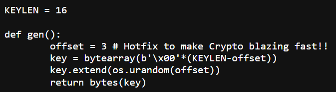
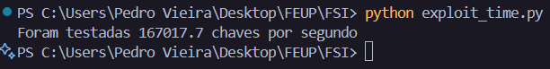

## Tarefa 1

Após analisarmos o programa “cipherspec.py”, que tem os algoritmos de geração de chaves, cifração e decifração, reparámos num erro que compromete consideravelmente a segurança e a eficácia do processo. 

Apesar dos algoritmos de encriptação e desencriptação estarem bem implementados, o grande problema reside na função que gera a chave, “gen()”. 

Na função, é definido um offset de 3, e a chave de 16 bytes (KEYLEN \= 16). Contudo, apenas os últimos 3 bytes da chave estão a ser randomizados, fazendo com que os primeiros 13 bytes da mesma sejam **sempre** iguais a “0x00”:

Como podemos observar, apenas o “offset” é passado na função “os.urandom()”, fazendo com que a chave tenha baixa entropia (já que o offset é apenas 3), deixando-a extremamente vulnerável a ataques de brute-force.

O algoritmo de encriptação e desencriptação deste ciphersuite passa por gerar uma chave na função “gen()”, que é passada como argumento em ambas as funções principais (ela corresponde ao primeiro argumento dessas funções, k), que usam o algoritmo AES no modo CTR (counter) para o procedimento.

De modo a decifrar o ciphertext e chegar à flag pretendida, vamos realizar um ataque que explora esta vulnerabilidade, realizando brute-force sobre os 3 bytes aleatórios. Para 3 bytes, existem (2^8)^3 combinações possíveis de valores. A ideia é o programa iterar sobre todas essas combinações até encontrar a chave correta, que irá retornar a mensagem corretamente decifrada.

De forma a automatizar o processo, ou seja, de forma a evitar que tenhamos que verificar cada output manualmente a ver se faz sentido, apenas precisamos que o programa verifique se a mensagem desencriptada começa por “flag{“ e termina em “}”. Se a mensagem não corresponder, ele faz mais uma iteração. Se corresponder, chegamos ao que pretendíamos.

## 

## Tarefa 2

Para determinar o valor mínimo do offset para o qual, no pior caso (ou seja, a chave correta é a da última iteração), as máquinas pessoais usadas no ataque não conseguissem decifrar a chave em 10 anos, reutilizamos o script de Python que fizemos e usamos para descobrir a flag, desta vez com o objetivo de medir quantas chaves são avaliadas por segundo, que nos vai indicar, após realização de cálculos, quantas chaves seriam avaliadas em 10 anos. O valor do offset é o inteiro mais pequeno, tal que:

2^(8 \* offset) \> número de chaves avaliadas em 10 anos

Após o uso da biblioteca “time” no nosso script para fazer essa medição, chegamos ao número de chaves avaliadas por segundo (usamos um tempo de 10 segundos e dividimos o número de chaves avaliadas por 10):

Deste modo, o número de chaves avaliadas em 10 anos seria:

167017.7 \* 60 (1 min) \* 60 (1 hora) \* 24 (1 dia) \* 365 (1 ano) \* 10 (10 anos) \~= 52 trilhões

O primeiro offset que faz com que a condição acima referida seja verdadeira é 6\.

Concluímos, desta forma, que o offset teria que ser igual a 6 bytes.

## Tarefa 3

A medida de usar um nonce e não o enviar na rede não é uma contra-medida eficaz para fortalecer a segurança destes esquemas de cifra, já que, apesar de dificultar o ataque por aumentar o número de combinações possíveis, ou seja, o atacante tem muito mais dificuldade em conseguir aceder aos dados desencriptados, acaba também por dificultar a vida ao utilizador legítimo, já que, se ele não tiver acesso ao nonce, que neste cenário ele precisaria para ter acesso aos seus dados desencriptados, a única forma de contornar o problema também seria testar possibilidades (mesmo tendo acesso à chave). Isto faria com que o próprio utilizador se tornasse, por mais irónico que pareça, um atacante.

Concluímos, desta forma, este CTF.

**Nota:** A flag encontrada foi flag{rppcqxgiztwfzoxn}  
