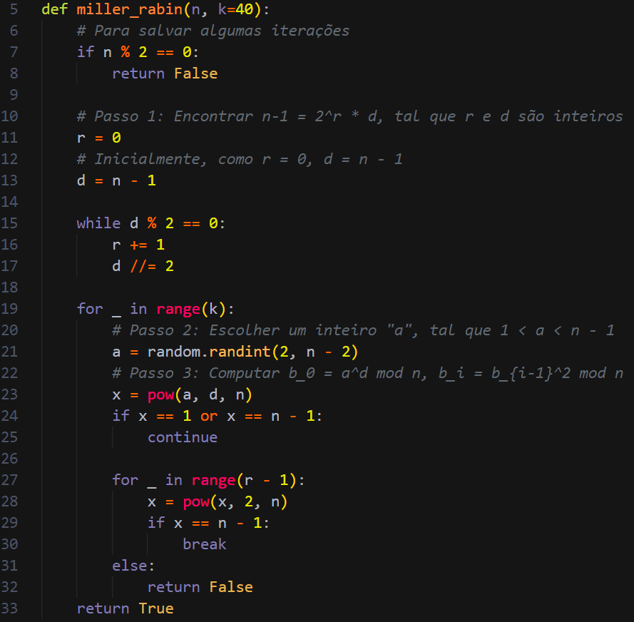

## Tarefa 1

Começamos por implementar, como sugerido, o algoritmo de Miller-Rabin, que avalia (com uma probabilidade muito alta) se um número é primo ou não. Este algoritmo é necessário neste contexto, já que estamos a lidar com números de grande dimensão:

O algoritmo foi implementado com base neste vídeo: [Miller-Rabin Primality Test](https://www.youtube.com/watch?v=qdylJqXCDGs).  
A única diferença é que, como estamos num contexto computacional e não manual, acrescentamos um argumento k (achamos 40 um valor adequado para equilibrar a balança entre performance e margem de erro) que testa várias bases “a” no range (2, n \- 2\) ao invés de apenas uma, de forma a diminuir a margem de erro.

## Tarefa 2

Agora que já temos uma forma de testar a primalidade de um número, precisamos de encontrar os primos envolvidos na encriptação da mensagem-alvo, que nos vão indicar o expoente privado, “d”, permitindo, assim, a realização do cálculo que vai decifrar a mensagem.

Tendo já a informação que o valor do primo “p” é próximo a 2^528 e “q” é próximo a 2^529 (já que somos o L06G07), apenas temos de testar a primalidade de números próximos a eles. 

Para isso, implementamos a função “find\_prime\_near()”:

O “d” é igual ao inverso modular do e em relação ao phi (função totiente, cujo valor retornado é (p-1)(q-1)), ou seja, obedece à condição:

**ed % (p-1)(q-1) \= 1**

O d será determinado através da função “extendedEuclidean()”, que usa o algoritmo de Euclides estendido para determinar o inverso modular através do MDC:

Este algoritmo foi implementado com base neste vídeo:  
[Extended Euclidean Algorithm Explained](https://www.youtube.com/watch?v=QEWvTVcpAyg)

## Tarefa 3

Usando a informação dos valores aproximados de p e q, declaramos as variáveis:

E fizemos um while-loop que chama a função “find\_prime\_near()” de forma a encontrar primos próximos de p e q.

Além disso, sabemos que p \* q \= n, o que ajuda a descartar pares de primos que não são os pretendidos (é um dos passos que ajuda a termos uma inferência correta dos valores). E, se p \* q \> n, sabemos que os valores de p e q não foram encontrados, e é lançado um erro que termina o programa imediatamente:

Após determinarmos p e q, podemos calcular a função totiente e o expoente privado:

Desta forma, tendo o valor de “d”, podemos começar a desencriptar o ciphertext.

Antes disso, convertemos o valor do cipher de hex para bytes, através da função “unhexlify()” usada no CTF anterior:

E procedemos à desencriptação:

A função “dec()” foi implementada baseada na função “enc()” do ficheiro “gen\_example.py”, fornecido no enunciado do CTF. Apenas precisamos de fazer o procedimento inverso ao realizado nessa função:

Mensagem \= cipher ^ d mod n

Por fim, só para garantir que os primos inferidos eram realmente os corretos (mesmo sabendo que era impossível não serem, já que não existem outros dois primos que multiplicados dão n, pois p e q são a fatorização de n) e que não houve problemas no processo de desencriptação, verificamos se a mensagem decifrada tinha o formato de uma flag. Se tivesse, ela era impressa na consola:

Ao correr o programa, após algum tempo, foi retornada a flag:

Concluímos, desta forma, este CTF.
