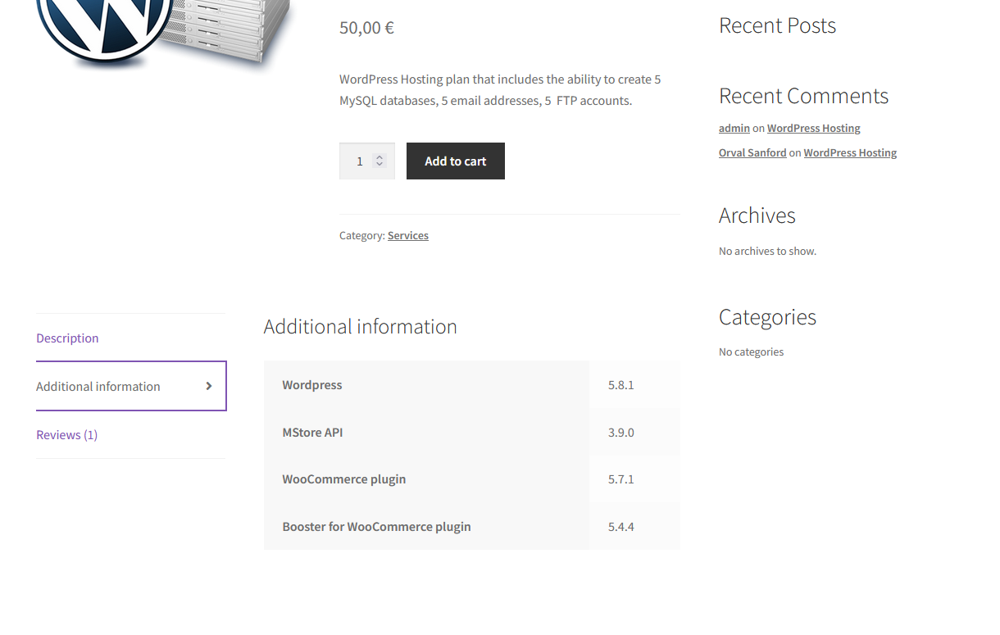
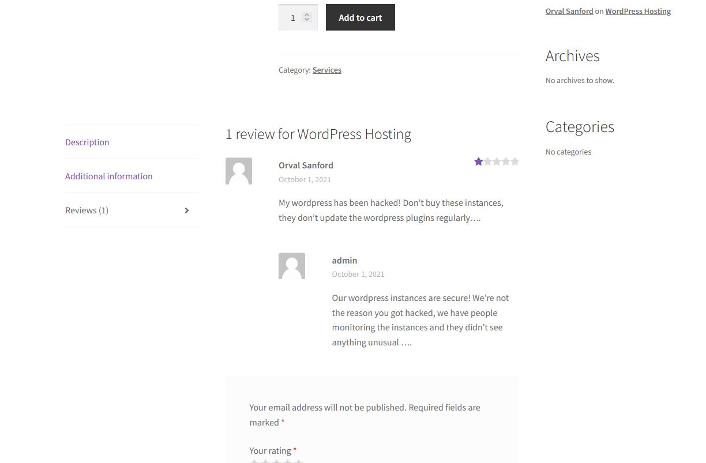
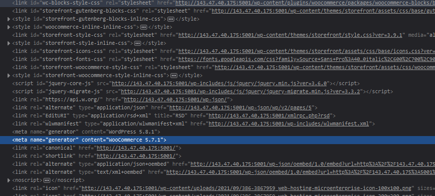
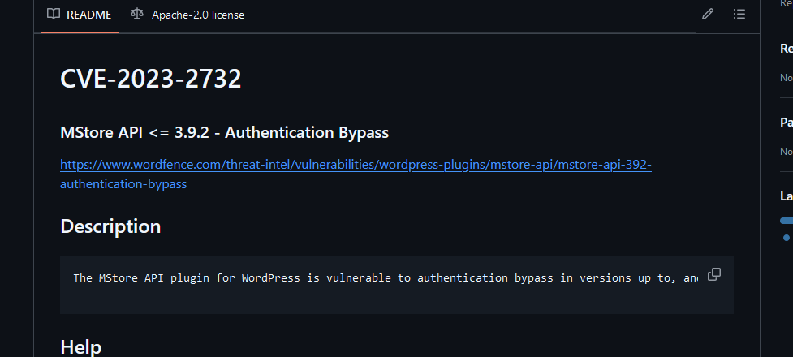
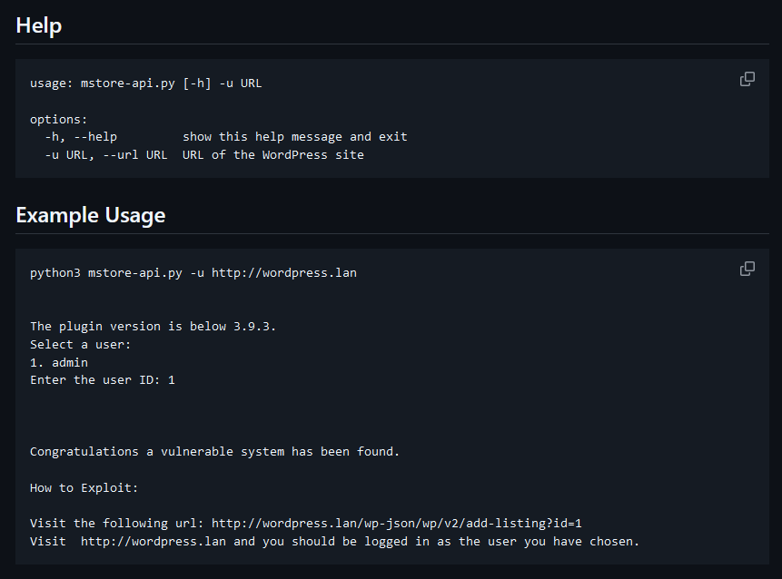
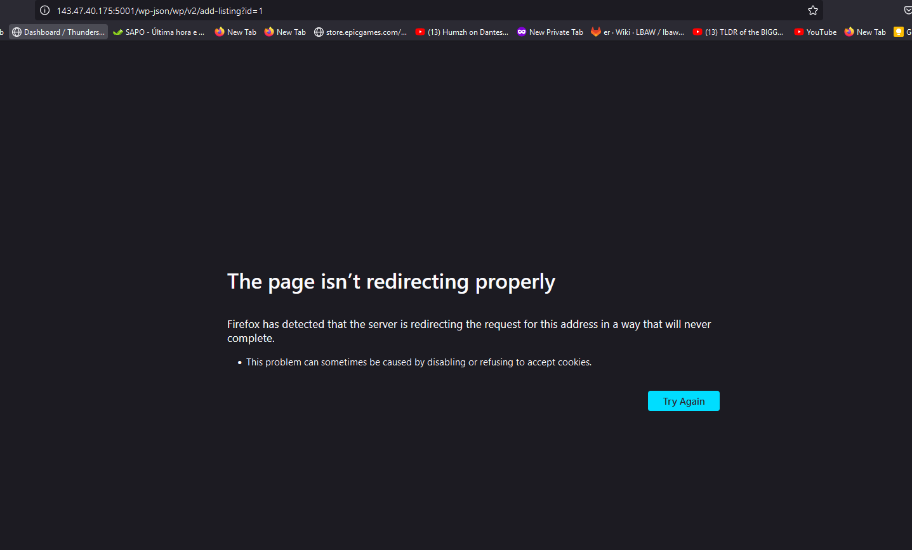
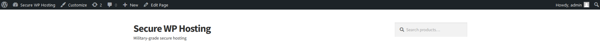
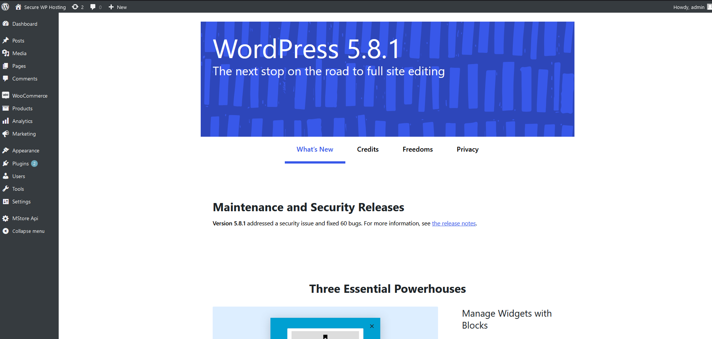
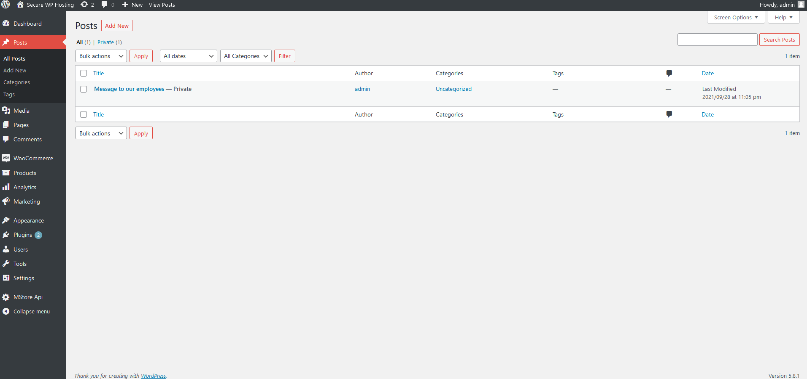
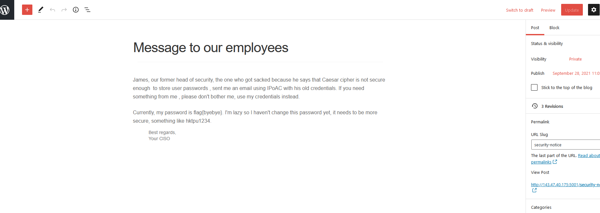

### Wordpress CVE

Primeiro nós inspecionamos o site para tentar ver os plugins que usava e encontrámos esta página que nos diz que eles oferecem um serviço de wordpress hosting e em que especificam a versão do wordpress, os plugins e as versões de plugins que usam.

Também encontrámos na secção de reviews deste serviço que havia um cliente insatisfeito por ter sido hackeado e que refere que o a razão teria sido por o serviço de hosting não estar com os plugins atualizados e a resposta do admin a dizer que não é verdade e que diz que são seguras porque na equipa dele há pessoas que estão a monitorizar isso.

Logo decidimos ir investigar se o cliente tinha razão e se haviam vulnerabilidades com as versões dos plugins do serviço de hosting e se houvessem, como o próprio site em que ele está a vender estes serviços é de wordpress (conseguimos ver no html), ele é bem capaz de estar a usar as mesmas versões de plugins neste site que usa no seu serviço de hosting.

Procurando por vulnerabilidades relativas à versão do wordpress e aos plugins acabámos por encontrar esta página de github [https://github.com/RandomRobbieBF/CVE-2023-2732](https://github.com/RandomRobbieBF/CVE-2023-2732) relativamente ao CVE-2023-2723 que pondo no site de CTF conseguimos confirmar que é a vulnerabilidade correta. Esta vulnerabilidade é referente ao plugin MStore API que no site usa a versão 3.9.0 e a vulnerabilidade aplica-se às versões inferiores ou iguais a 3.9.2.

Nós em seguida não lemos corretamente o guia e simplesmente mudámos as últimas duas coisas que nos dizia para fazer para em vez de wordpress.lan ter 143.47.40.175:5001 e como o admin era o user 1 tal como no exemplo conseguimos.

Mas mais tarde percebemos que era suposto termos executado um script de python como demonstrado no guia para ter uma lista dos utilizadores e ai perceber que o utilizador admin era o 1 e mudar o URL para o id 1.

Ao ir ao URL [http://143.47.40.175:5001/wp-json/wp/v2/add-listing?id=1](http://143.47.40.175:5001/wp-json/wp/v2/add-listing?id=1) , obtemos que o browser nos diz que houve um erro ao redirecionar direito.

E se voltarmos ao site normal, podemos ver que em cima temos a barra de administrador do site de wordpress:

Carregamos no icon de wordpress no canto superior esquerdo:

Vamos aos posts:

E temos a flag que nos faltava na mensagem que o admin enviou aos seus empregados:

Concluindo assim o CTF.

Resolver a vulnerabilidade:

Atualizar o plugin MStore API da versão 3.9.0 para a versão mais recente ou pelo menos para a versão 3.9.3.