## Environment Variables

Este CTF foi realizado no servidor web [http://ctf-fsi.fe.up.pt:5002/](http://ctf-fsi.fe.up.pt:5002/)

### Desafio 1

Em primeiro lugar, exploramos de forma geral o website para encontrar a vulnerabilidade. Acabamos por reparar que no topo do mesmo havia um input que, após clicar no botão “Enviar”, era concatenado a uma instrução “ls \-al”, e a bash (descobrimos que a shell a ser usada era a bash na lista de softwares instalados) era chamada para executar essa instrução através de um CGI chamado “list.cgi”. Como isso nos dava acesso aos diretórios subjacentes ao servidor web, sabíamos que ali estava o perigo iminente. Na primeira vez que clicamos no botão, testamos usando o caminho atual:  

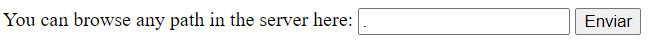

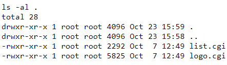

Também averiguamos que se o input fosse “;”, que deveria simplesmente encerrar o comando ls \-al, as variáveis de ambiente eram expostas. Isso fez-nos assumir que o CGI estava configurado para listar as variáveis de ambiente por defeito.  

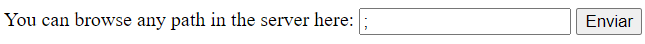 

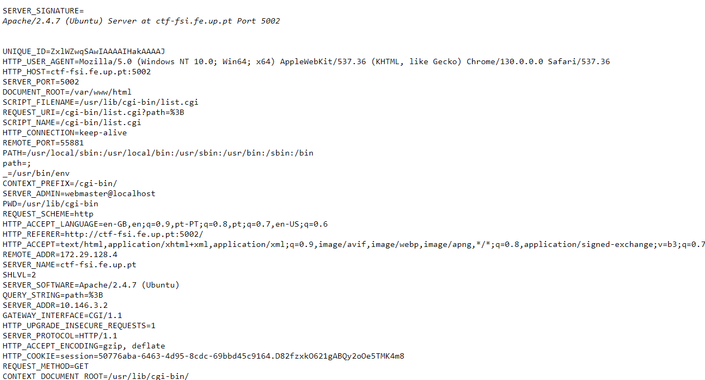

Desta forma, percebemos que a vulnerabilidade estava relacionada à bash e à exposição das variáveis de ambiente na mesma, já que não só as mesmas eram expostas, mas também eram automaticamente executadas, já que o binário ls surtiu efeito.

Fomos então pesquisar algum CVE relacionado a variáveis de ambiente e à bash, cuja versão soubemos através da lista mencionada anteriormente. Visitamos então o link do primeiro resultado relativo ao CVE 2014-6271:  

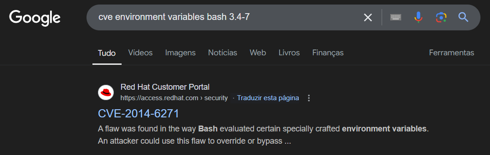

A descrição da vulnerabilidade pareceu-nos adequada ao contexto deste CTF, e confirmarmos na submissão da flag do Desafio 1 que este era sim o CVE pretendido:  

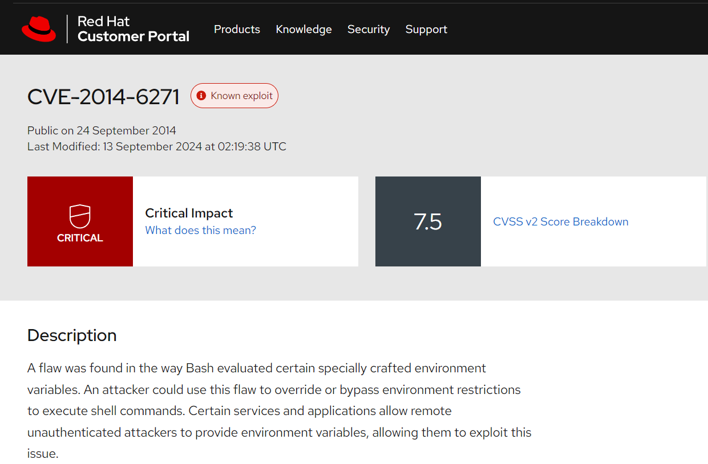

### Desafio 2

Agora, tivemos de encontrar a flag secreta, que estava num diretório ainda desconhecido.

No diretório atual já impresso anteriormente nada nos indicava que a flag estava ali. O diretório .. também não. Fomos então ver o que estava no diretório root (/):  

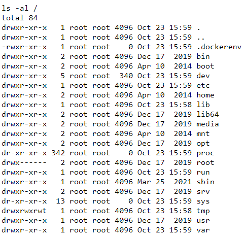

O único diretório que parecia dar sinal que poderia ser o pretendido era o “var”. Fomos então investigar o que estava contido nele:  

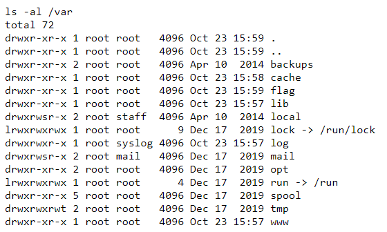

E encontramos o diretório que continha a flag:  

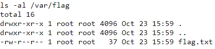

Agora, bastava imprimir o conteúdo do ficheiro “flag.txt” e descobrir a flag secreta. Como o nosso input não era sanitizado, fizemos uma injeção de comandos para o efeito. Colocamos o “;” inicialmente para terminar o comando “default” de imprimir as variáveis de ambiente e executámos o comando more com o caminho absoluto para o ficheiro “flag.txt” como argumento de maneira a imprimir o conteúdo do mesmo na página web:  

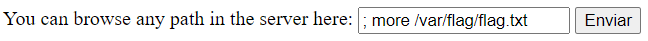

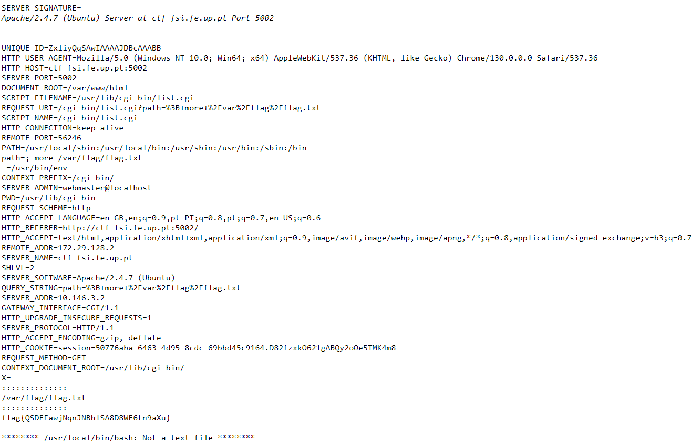

Demos então fim à resolução deste CTF.

Medidas que poderiam ser tomadas para evitar isto seriam a sanitização do input (para impedir command injection) e a filtragem do conteúdo das variáveis de ambiente, para impedir que código malicioso fosse contido nelas.  
