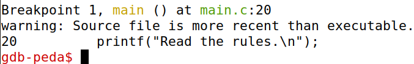

## Ambiente

Este CTF foi realizado com uso do servidor web [http://ctf-fsi.fe.up.pt:4000/](http://ctf-fsi.fe.up.pt:4000/)

Em primeiro lugar, instalamos a biblioteca pwntools (que permite a interação de um script Python com executáveis e serviços remotos, facilitando a escrita de exploits):  

(...)

Depois, instalamos o pacote checksec, que serve para verificar que proteções um programa tem:  

Vamos, então, verificar as proteções aplicadas ao binário “program”:  

A partir deste output, podemos tirar as seguintes conclusões:

* O executável tem arquitetura x86, mas 32 bits. Para correr o mesmo, teremos de instalar o pacote “gcc-multilib”;  
* O programa não possui RELRO, o que nos permite modificar o return address de algumas funções do executável;  
* Existe um canário na stack, mas isso não afetou o ataque;  
* NX é desconhecido, mas isso também não afetou o ataque (a stack permaneceu executável);  
* Não existe PIE, pelo que não há randomização de endereços do executável;  
* Existem segmentos de RWX, permitindo leitura, escrita e execução de partes da stack.

Instalamos, então, o pacote referido (“gcc-multilib”):  

## Desafio

Começamos por analisar o código fonte do programa que corre no server (main.c):

* **Existe algum ficheiro aberto e lido pelo programa?:** Sim, “rules.txt”;

* **Existe alguma forma de controlar o ficheiro que é aberto?:** Sim, temos de sobrescrever o argumento da função “readtxt” para “flag”;

* **Existe algum buffer-overflow? Se sim, o que é que podes fazer?:** Sim. O programa permite receber um input de até 45 bytes, mas o buffer onde ele será armazenado tem apenas 32\. O que podemos fazer é enviar um buffer que contém “flag” e o return address da função “readtxt” (já que o input apenas é lido após a variável “fun”, um apontador de função, ser redefinida para o endereço de uma outra função: “echo”. Para conseguir obter a flag, temos que chamar a função “readtxt” com “flag” a ser passada como argumento). Como o conteúdo da stack depende da ordem de declaração das variáveis, e “fun” é declarada imediatamente antes do buffer no programa do servidor, sabemos que a mesma está alocada imediatamente a seguir ao fim do buffer. 

Portanto, para fazer o ataque funcionar, apenas precisamos de descobrir o return address da função “readtxt” e sobrescrevê-lo no endereço imediatamente após o término do buffer.

Para isso, demos debug ao binário “program”:

Como podemos reparar no programa “main.c”, a variável “fun” contém o return address da função “readtxt”, na linha 21:  

Portanto, é só fazer um breakpoint na linha 22 da função “main” e imprimir o valor de “fun”:  

Executámos o programa até ao breakpoint inicial:  

Demos 2 “next’s” para chegar à linha 22:  

E, ao imprimir o valor de “fun”, já sabemos o return address da função “readtxt”:  

De forma a construir o buffer, vamos utilizar o programa “exploit-template.py”.

O buffer que vamos enviar para o programa será, então, os bytes da string “flag” (que são 4, já que “flag” tem 4 caracteres), seguidos de 28 “null-terminator’s” (para a leitura do argumento da função “readtxt” terminar no sítio certo e preencher o resto do buffer), finalizando, já em buffer overflow, com o return address de “readtxt” em 32 bits:

Em primeiro lugar, testámos localmente se conseguimos imprimir corretamente a “flag” (neste caso colocada dentro de um ficheiro “flag.txt” no mesmo diretório local):

E, ao executar o programa, vimos que tivemos sucesso:  

Ao tentarmos atacar o servidor remoto, conseguimos imprimir a “flag-alvo” deste CTF, concluíndo o mesmo:

