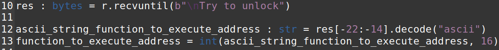

## Ambiente

Este CTF foi realizado no servidor web [http://ctf-fsi.fe.up.pt:4005](http://ctf-fsi.fe.up.pt:4005/).  

Nele, vamos usar o módulo de format strings da biblioteca pwntools instalada no contexto do CTF anterior.

## Desafio

Começamos por verificar as proteções do binário “program”:

Verificamos que são as mesmas proteções do binário do último CTF.

De seguida, analisámos o código fonte do programa que corre no server (main.c):

* **Existe algum ficheiro aberto e lido pelo programa?:** Sim, “rules.txt”;

* **Existe alguma forma de controlar o ficheiro que é aberto?:** Sim, temos de sobrescrever o valor do argumento da função “readtxt” para “flag”;

* **Existe alguma format string? Se sim, em que é vulnerável e o que é que podes fazer?:** Sim. Após a leitura do buffer inputado por nós, o programa executa um printf(buffer) sem argumentos (que é a vulnerabilidade). A única coisa que precisamos fazer é descobrir o endereço da função “readtxt”, redefinir o valor do endereço de “fun” para ele (para “fun” apontar para “readtxt” ao invés de “echo”) e colocar isso no buffer depois de ‘flag’ (com single quotes de forma a que a flag ocupe 6 bytes, já que, na função “readtxt”, o memcpy é feito com 6 bytes e o comando “cat” não é afetado pelas single quotes \- escrever “cat flag.txt” é equivalente a escrever “cat ‘flag’.txt”).

Desta forma, começamos por descobrir o endereço de “readtxt”, através de debug:  

Fazemos um breakpoint na função:  

Corremos:  

E printamos o endereço de readtxt, descobrindo-o:  

De seguida, como o endereço de “fun” muda a cada execução, tivemos de arranjar uma forma de o retirar diretamente do output original de main:  

O endereço de “fun” consta após “I will give you a hint” e, através das imagens, podemos verificar que efetivamente muda a cada execução.

De forma a retirá-lo diretamente deste output, fizemos:  

Seguimos os seguintes passos:

* Lemos o output até “\\nTry to unlock” (para conter o endereço pretendido) e convertemos a string em bytes, guardando esses dados na variável “res”;

* Depois, verificamos que o endereço é escrito a 22 caracteres do fim de “res” e, como o endereço tem 8 caracteres (já que o programa corre numa arquitetura de 32 bits), queremos ler do caracter \-22 até ao caracter \-14 (-22 \+ 8), sem conter o caracter \-14. Convertemos de volta para string e guardamos na variável “ascii…”

* Depois salvamos essa string como hex em “function…”. Desta forma, essa variável contém o endereço da função.

Guardámos o endereço de “readtxt”:  

Por fim, montámos o payload, que vai ser “‘flag’00” (‘flag’ \+ null-terminator) mais a função “fmtstr\_payload”, da própria biblioteca pwntools, que vai gerar uma string formatada para modificar o valor do endereço de “fun”:  

O offset (3) foi determinado por tentativa e erro, e “numbwritten” é 8, já que já tinham sido escrito 8 chars antes (‘flag’00 tem 8 caracteres).

Ao enviar este payload, conseguimos imprimir a flag, tanto localmente:  

Como remotamente:  

**Nota:** O teste remoto foi feito fora da VM, já que dentro da mesma o host não estava a ser reconhecido. 

Anexo (código Python):  

Concluímos, desta forma, este CTF.
