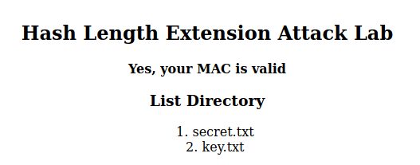

# Hash Length Extension Attack Lab

## Environment Setup

Este Seed Lab foi realizado no servidor web [https://www.seedlab-hashlen.com/](https://www.seedlab-hashlen.com/) no container 10.9.0.80.

Em primeiro lugar, usamos os comandos Docker habituais para construir a imagem do servidor que vamos atacar e executar os seus containers:  

De seguida, adicionamos ao ficheiro “/etc/hosts” o servidor que vamos atacar, associando ao mesmo o container referido:  

Para finalizar a preparação de ambiente, executamos “dockps” para verificar se os containers pretendidos estavam a correr:  

## Task 1

Nesta task, vamos enviar um request benigno ao servidor para ver como o mesmo responde.

Este servidor exige a passagem de alguns parâmetros no URL para validar o pedido feito: “myName”, “uid”, um comando (que pode ser “lstcmd”, que lista os ficheiros, ou download, que imprime o conteúdo dos ficheiros, tendo como alvo o diretório LabHome) e um “MAC address”, que serve para evitar ataques Man-in-the-Middle, ao verificar que os dados do request não são alterados. Neste contexto, teremos de determinar o seu valor.

Em primeiro lugar, averiguamos o conteúdo do ficheiro “key.txt”, de forma a obtermos “uid’s” e chaves já pré-definidas, com o objetivo de testar o servidor (a chave MAC irá ser incluída no MAC address):

Decidimos escolher a key “1002:983abe”.

De seguida, obtivemos, através do algoritmo de hash SHA-256, a hash que vai corresponder ao MAC address, ao enviar como input uma string contendo os argumentos escritos na forma:

`<key>:myname=<name>&uid=<uid>&lstcmd=1`

Agora que temos o valor do MAC address, conseguimos formar o URL que precisamos:

[http://www.seedlab-hashlen.com/?myname=PedroVieira\&uid=1002\&lstcmd=1\&mac=4bbab8148f2f34581533963ea88995b203d46db1773da65f35084059b45d325c](http://www.seedlab-hashlen.com/?myname=PedroVieira&uid=1002&lstcmd=1&mac=4bbab8148f2f34581533963ea88995b203d46db1773da65f35084059b45d325c)

Enviámos então o nosso request e o servidor respondeu positivamente, executando o comando “lstcmd” passado:  

Agora, vamos tentar, além do comando “lstcmd”, também executar o comando “download”, querendo imprimir o conteúdo do ficheiro “secret.txt”.

Da mesma forma, determinámos o valor do MAC address deste request:  

Construímos novamente o URL:

[http://www.seedlab-hashlen.com/?myname=PedroVieira\&uid=1002\&lstcmd=1\&download=secret.txt\&mac=a3d3ddbc734e06c3736cf9e9d8b0d30f21410e1a3352ee2dda0c4287f6e13659](http://www.seedlab-hashlen.com/?myname=PedroVieira&uid=1002&lstcmd=1&download=secret.txt&mac=a3d3ddbc734e06c3736cf9e9d8b0d30f21410e1a3352ee2dda0c4287f6e13659)

E a resposta do servidor foi, de novo, a esperada, e concluímos que o conteúdo do ficheiro “secret.txt” era “TOP SECRET. DO NOT DISCLOSE”:  

## Task 2

Nesta task e na próxima, vamos executar o ataque de facto. Neste cenário, não sabemos a secret key, mas, mesmo assim, conseguimos gerar um MAC address válido a partir do MAC address anterior (nesta task, vamos pedir ao servidor para executar ambos os comandos mencionados anteriormente através apenas do MAC address do comando “lstcmd”), já que esse MAC address contém a secret key, fazendo o servidor acreditar que nós a sabemos.

Para que isto aconteça com sucesso, temos de ter em conta que o algoritmo SHA-256 aplica o hash a blocos de 64 bytes (que correspondem a 64 caracteres), ou seja, a string que vai ser passada para o algoritmo tem que ter um tamanho múltiplo de 64\. Quando esse não é o caso, neste contexto, o servidor automaticamente aplica um “padding” à string, de forma a que a mesma passe a ter um tamanho adequado. Para que esse “padding” não seja confundido com os dados passados no request, ele é delimitado, segundo o protocolo RFC 6234, por um byte “\\x80” e por um campo de 8 bytes cujo valor é o número de bits (em hexadecimal) da mensagem-alvo do “padding”. Dentro desses delimitadores, são colocados vários “\\x00”, e o número de “\\x00” colocados é o necessário para que a string final tenha o tamanho pretendido.

Portanto, por exemplo, quando na Task 1 passamos a string **“983abe:myname=PedroVieira\&uid=1002\&lstcmd=1”**, como o tamanho da mesma não é um múltiplo de 64, o servidor automaticamente acrescentou um “padding”, e essa string final foi a que efetivamente gerou o MAC address.

Portanto, a string passada ao algoritmo SHA-256 foi:

“983abe:myname=PedroVieira\&uid=1002\&lstcmd=1” \+ padding

E não apenas “983abe:myname=PedroVieira\&uid=1002\&lstcmd=1”.

Como já mencionado, a ideia deste ataque é gerar um novo MAC address válido a partir do anterior, e isso pode ser feito ao começar o novo hashing a partir do estado do hashing anterior, concatenar à string acima conteúdo extra, e pedindo ao servidor para dar rehash, que apenas atualiza o MAC address antigo tendo em conta a mudança do request, ao invés de criar um do zero, mantendo a secret key incluída nele.

Ou seja, para um MAC address válido ser gerado, temos de passar ao algoritmo:

**String original** \+ “\&download=secret.txt” \=

\= **“983abe:myname=PedroVieira\&uid=1002\&lstcmd=1” \+ padding** \+ “\&download=secret.txt”

A partir deste raciocínio, concluímos que, neste caso, vamos ter que fazer o “padding” manualmente, para que a string original não seja afetada, pois, se deixássemos o server fazer o “padding”, a string passada nesta task seria:

“983abe:myname=PedroVieira\&uid=1002\&lstcmd=1” \+ “\&download=secret.txt” \+ padding

Nós não queremos o padding no fim, queremos no meio da string.

Começamos, então, por calcular o padding da string original. Para isso, determinamos o length da mesma:

De seguida, convertemos esse tamanho para bits (43 \* 8 \= 344), e depois para hex (344 em hex é 158), de forma a saber o valor a colocar no delimitador final do “padding” (como estamos a usar Big-Endian, vamos passar o valor diretamente sem necessidade de inversão de ordem dos bits).

Portanto, a quantidade de “\\x00” que o “padding” vai ter será:

64 (tamanho do bloco) \- 43 (tamanho da string original) \- 1 (1 byte do \\x80) \- 2 (2 bytes do 0x158) \= 18

Isso permite-nos concluir que o padding acrescentado à string original será:

“\\x80  
\\x00\\x00\\x00\\x00\\x00\\x00\\x00\\x00\\x00  
\\x00\\x00\\x00\\x00\\x00\\x00\\x00\\x00\\x00  
\\x01\\x58”

## Task 3

Nesta task, vamos fazer o ataque direto ao servidor.

Agora que temos todos os dados que precisamos, conseguimos obter o MAC address forjado através do programa length\_ext.c:

De forma a que este hashing começasse a partir do estado anterior, passamos o MAC address original entre as linhas 14 e 21\. 

Além disso, acrescentamos, na linha 23, a mensagem “\&download=secret.txt”, que tem 20 caracteres.

Com estas duas mudanças em relação ao código original, conseguiremos obter o MAC address.

Compilámos o programa:

E, ao executar, obtivemos o MAC address:

Só nos falta construir o URL que vai realizar o ataque com sucesso. O URL que temos de passar ao servidor é:

[http://www.seedlab-hashlen.com/?myname=PedroVieira\&uid=1002\&lstcmd=1%80%00%00%00%00%00%00%00%00%00%00%00%00%00%00%00%00%00%00%01%58\&download=secret.txt\&mac=c701071261fc457e82a7f1a28bda81cfe7935e243a41dea8a0b1fe19f2b6c007](http://www.seedlab-hashlen.com/?myname=PedroVieira&uid=1002&lstcmd=1%80%00%00%00%00%00%00%00%00%00%00%00%00%00%00%00%00%00%00%01%58&download=secret.txt&mac=c701071261fc457e82a7f1a28bda81cfe7935e243a41dea8a0b1fe19f2b6c007)

**Nota:** Em contexto de URL, “\\x” teve de ser substituído por “%”.

E, como esperado, o ataque funcionou:

Concluímos, desta forma, este Seed Lab.
