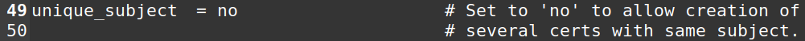
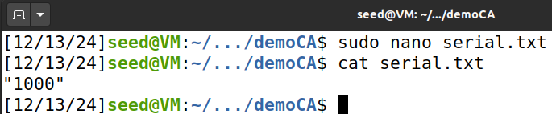
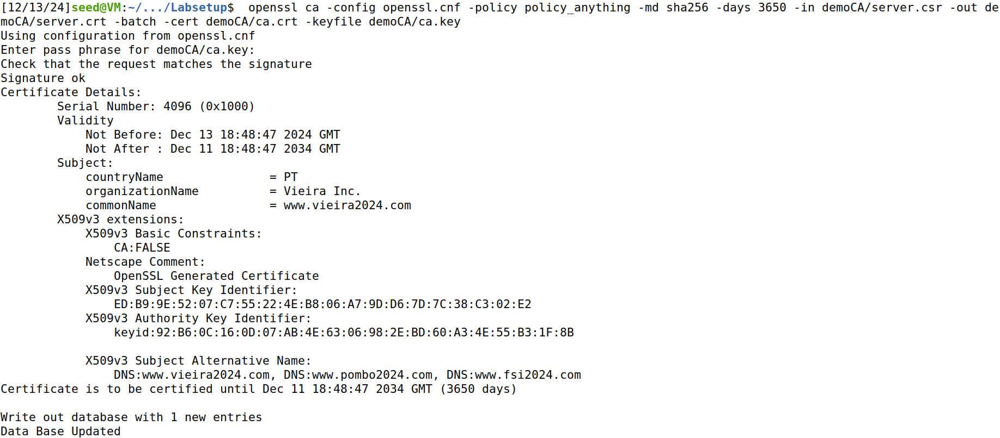

# Public Key Infrastructures Lab

## Environment Setup

Este Seed Lab foi realizado no servidor web [www.vieira2024.com](http://www.vieira2024.com) no container 10.9.0.80.

Em primeiro lugar, associamos o domínio do servidor web ao IP do container, editando o ficheiro “/etc/hosts”:

**Nota:** Além do servidor mencionado, foi também associado o domínio [www.bank32.com](http://www.bank32.com) (por precaução).

De seguida, através dos comandos Docker habituais, construímos a imagem do server e executámos os seus containers:

## Task 1

Nesta task, vamos criar a nossa CA (Certificate Authority).

Neste contexto, vamos ter de copiar o ficheiro de configuração default para o nosso diretório atual, já que teremos de modificar esse ficheiro:

De seguida, abrimos o ficheiro e demos uncomment à linha que contém “unique\_subject”, de forma a permitir a criação de certificações com o mesmo sujeito (já que apenas uma entidade \- nós \- as vai emitir):

Depois, criámos os diretórios necessários para estruturar a nossa CA:

Definimos o serial number para a string “1000”:

E executamos o seguinte comando para gerar o certificado assinado por nós próprios, como CA:

**Nota:** a passphrase escolhida foi “dees”.

Agora, pretendemos ler o conteúdo do certificado gerado. Para isso, corremos no terminal:

(...)

Além disso, também queremos ler a chave privada do certificado. Para tal finalidade, corremos no terminal:

(...)

No conteúdo do certificado, podemos verificar que, de facto, o mesmo é um CA, pois existe uma “Basic Constraint” chamada “CA” que está a True:  

Também podemos concluir que o certificado é “self-signed” (assinado pela própria organização/entidade que o emitiu), pois os campos “Issuer” (organização/entidade que emitiu o certificado) e “Subject” (organização/entidade para a qual o certificado foi emitido) são iguais:  

No ficheiro RSA, são mostrados os valores dos elementos:  
**publicExponent:** 65537 (0x10001)  
**privateExponent:**  
    00:c2:61:0b:78:cb:76:bb:8a:1f:ac:31:14:c3:16:  
    e9:d5:41:7a:36:42:3a:73:11:a8:12:61:79:52:24:  
    6f:d5:05:1a:8a:ff:bb:da:ac:73:a9:fa:ef:77:74:  
    d4:67:ab:84:60:c1:a7:04:50:36:40:f0:4e:23:b9:  
    66:a1:ed:9e:19:6c:79:ae:c8:5c:7e:29:dc:3e:f0:  
    b6:fc:19:ba:cd:f6:91:25:72:f5:29:54:69:d8:cc:  
    04:95:73:26:02:fe:2e:9b:93:09:28:a0:ba:49:f8:  
    02:00:f9:92:85:f2:1d:21:2c:5b:aa:17:2b:ca:df:  
    dc:d2:83:5e:65:db:c1:fd:84:f9:23:5a:ed:bb:29:  
    f0:29:3a:d4:68:2c:63:be:8e:6e:74:c0:15:54:16:  
    7b:ae:d8:4a:26:8d:ca:40:c9:a3:10:ce:e6:16:78:  
    7b:ab:6c:63:d9:02:b9:07:4b:62:0b:64:79:84:be:  
    6c:45:c2:47:83:7c:01:ad:82:f3:76:1f:60:8f:f4:  
    07:73:21:f1:8c:d2:2a:a8:11:df:49:ca:59:7a:0e:  
    2b:f7:b6:bd:01:f7:04:d7:99:50:52:5c:e3:4d:9f:  
    f5:e3:37:2e:a4:38:05:5e:4c:d4:e9:e6:56:9a:65:  
    db:29:bb:50:75:cb:ce:82:37:fa:95:fd:5f:cf:28:  
    3b:07:c9:20:ec:39:c8:6e:7f:74:c1:d8:03:7e:f9:  
    d6:d7:44:06:d9:f5:09:ce:3a:82:eb:7b:43:59:3b:  
    11:8a:85:ca:67:9b:8d:7b:41:9a:7b:7d:6a:37:94:  
    55:dd:38:45:55:43:04:42:b5:36:30:08:8b:2a:98:  
    88:71:98:6f:aa:a0:7c:8a:19:5d:af:9c:ef:7a:6f:  
    6c:28:90:90:74:1a:05:f4:77:81:07:57:10:00:63:  
    28:9e:33:e5:03:c9:f1:e0:c8:00:37:70:05:af:83:  
    4e:15:fa:cd:da:61:e2:7b:96:ff:b9:53:ad:e6:f7:  
    5b:f3:87:db:20:2c:ab:b9:2c:58:8c:a8:74:35:c4:  
    64:9a:3d:51:2d:35:08:a6:d1:5f:01:8c:50:77:11:  
    c2:1d:8e:1c:a8:42:3f:43:47:cf:b6:97:53:b2:10:  
    de:1e:c8:12:f7:e9:e6:bb:68:5b:12:77:1b:32:6a:  
    2c:02:b6:e1:6f:42:8b:80:09:fd:cc:a0:3b:c5:57:  
    1c:4a:e6:ea:53:22:5b:c5:7e:c5:70:cc:c3:76:40:  
    98:a7:41:df:59:b0:dd:7e:15:a5:ab:65:bd:2e:66:  
    62:d2:67:be:ad:51:31:cf:4f:9e:8c:32:d3:80:f0:  
    a5:1c:c9:d2:ae:fe:91:9e:57:b5:12:ac:3e:af:00:  
    9d:bb:a1

**modulus:**  
    00:d1:44:c8:74:4c:df:74:51:18:01:7b:c4:e8:04:  
    f7:5c:e0:b3:7c:56:c4:da:29:01:ed:1d:a5:99:54:  
    01:d2:a7:1e:fe:89:a5:86:cd:2a:9c:6b:20:50:e5:  
    7f:37:37:78:33:3a:fb:ed:d4:53:34:62:89:88:a6:  
    0a:17:14:90:87:05:70:23:66:bc:2d:69:56:ba:2f:  
    94:65:3c:4f:31:e8:3a:2f:a3:a9:04:3c:bd:4c:85:  
    62:70:1d:73:d1:49:82:44:04:4a:e7:c2:71:f1:ba:  
    64:58:5c:bc:4c:a0:0d:ce:bc:56:a8:94:dc:cf:30:  
    ca:34:bc:93:06:b6:65:74:e5:c7:20:a0:36:ba:c4:  
    e9:43:16:bd:c7:07:4a:b5:76:ce:99:8e:fb:f4:82:  
    91:8b:dd:03:e3:ac:10:3e:64:16:8d:1f:fb:50:01:  
    8e:7c:bb:8e:e1:63:14:5e:fe:54:f5:fe:49:bb:fd:  
    69:eb:0d:0c:ef:51:bf:e6:2e:72:d8:85:ed:a5:10:  
    93:40:c7:0d:a0:f4:e3:19:f7:66:c5:34:f5:b7:1c:  
    42:ac:0b:d4:21:d4:12:de:39:0a:b4:a2:c1:9c:58:  
    76:81:43:0c:e8:78:25:92:8d:07:7d:1b:94:c8:32:  
    38:19:31:41:29:cb:62:1a:96:b1:0a:04:61:95:a3:  
    11:d8:b3:67:49:d5:09:26:0b:ef:a8:15:2a:c8:36:  
    18:a5:44:1e:b7:c1:27:d5:00:a0:fa:7f:78:de:21:  
    05:05:46:41:7f:6a:b8:5c:75:43:50:34:49:42:96:  
    6e:22:bc:ae:8e:3b:0f:03:d2:90:d5:3c:13:ea:0c:  
    71:2e:f1:7a:92:2a:e0:e7:ff:a0:85:cf:ae:03:52:  
    78:d6:ca:41:12:08:be:53:3f:1d:c5:6e:35:ba:b7:  
    e1:8f:42:19:7d:17:8e:fc:4a:9a:37:3c:49:20:df:  
    6e:9f:ed:04:bb:e0:51:76:38:54:f7:db:79:a4:10:  
    47:f2:b3:18:82:93:7a:8a:9b:2c:8a:82:19:54:60:  
    cd:75:3f:bc:78:c9:d8:ce:3f:fd:25:a6:84:c8:8b:  
    e5:67:d4:06:99:53:56:01:90:ef:b2:ce:54:77:5d:  
    08:79:0d:d7:9b:1d:41:9e:05:e5:fc:a0:df:70:13:  
    8a:62:ba:b3:cb:ab:c1:fa:57:75:02:39:a9:82:b5:  
    4e:81:b7:a8:bb:f9:dd:4d:b6:b0:35:19:b2:74:99:  
    f0:50:46:45:c9:c8:a2:ae:f5:dd:d9:71:9e:a2:ba:  
    e0:14:c5:f7:ed:45:2a:1e:5a:14:20:16:08:2a:22:  
    18:91:4f:22:f3:0e:7a:06:12:15:4f:4a:95:4c:30:  
    ec:a3:69

**prime1:**  
    00:f7:39:d1:23:77:e1:61:ff:b8:ec:61:2d:9a:8e:  
    be:06:9f:b1:9d:6c:02:5a:3b:8c:8c:49:b7:82:c2:  
    ca:9d:8d:97:35:ba:47:6f:35:bc:46:6a:c1:66:b1:  
    67:2e:98:6d:e0:a6:6b:99:f8:c0:9a:f7:a4:74:5b:  
    62:c0:80:b8:7f:5c:5f:5a:87:46:f9:18:82:5d:6e:  
    33:d4:87:fd:8b:ca:10:9a:9c:9f:a4:41:43:91:ad:  
    29:1f:37:c5:27:3e:53:ab:9f:f9:8f:c5:a1:a7:d4:  
    cd:50:ca:11:22:8f:a0:b9:bf:8c:e7:3c:e6:fb:32:  
    6f:b5:79:da:a5:78:55:82:8f:98:a7:52:03:ca:89:  
    96:ea:68:1c:3d:55:34:64:7d:11:26:a3:8b:72:e4:  
    a9:db:69:51:39:c5:9f:f5:6d:93:57:c4:1f:bb:ae:  
    fd:30:f9:86:ad:ab:38:95:b1:dc:f6:38:b3:4b:d2:  
    59:4a:1f:d4:4f:ec:64:8d:b0:1b:78:d6:70:49:e6:  
    b7:68:cc:01:95:15:4b:98:99:48:98:03:92:c0:8d:  
    bd:97:97:31:d6:7c:cd:5b:07:8f:19:ca:46:80:80:  
    64:f8:b1:eb:e4:5d:7a:61:12:d9:e7:f7:32:09:91:  
    84:7b:1d:a1:d5:3b:53:12:e5:42:0c:c9:ab:e5:fd:  
    fb:ed  
**prime2:**  
    00:d8:b2:1a:b5:4c:91:47:45:e9:9a:dd:be:61:ae:  
    73:b8:f0:f4:fb:63:53:cb:f6:65:f9:c8:7e:a9:2e:  
    5d:50:7a:52:1b:96:56:f7:e1:c5:0c:7c:5a:c9:ed:  
    39:0d:5f:96:a2:0b:a5:d9:4b:b6:ab:46:29:4d:26:  
    18:e4:ed:b1:32:4d:f6:41:4b:f9:b2:dd:f9:56:60:  
    9e:d1:95:f8:71:c6:a3:53:c3:45:17:f3:82:47:c0:  
    4e:a2:60:4b:51:42:70:fb:e5:60:44:3d:74:20:a8:  
    68:f9:9f:a2:41:7d:fc:72:77:70:b5:a5:af:a0:cf:  
    1e:29:a3:a2:92:a8:c0:29:08:3a:98:74:a4:da:36:  
    eb:ec:ef:db:c5:1e:94:4e:62:67:21:57:9b:4e:68:  
    16:b2:25:cd:ef:f7:52:bf:db:0c:7b:e5:24:88:3e:  
    13:10:2c:ad:cf:d6:90:b5:16:0f:5b:77:04:37:42:  
    e7:74:d1:00:c0:f2:29:a0:90:b3:85:d6:78:c2:37:  
    0a:87:28:b8:38:87:36:43:26:ee:72:d8:69:1a:6e:  
    34:ac:25:d5:e4:01:21:63:3e:1b:ef:47:d9:3d:63:  
    5b:e2:7f:70:39:8c:bd:ce:00:46:26:20:b2:c5:f3:  
    2e:93:ae:24:e6:d9:98:ed:17:0f:c4:7b:02:fa:d0:  
    ed:ed

## Task 2

Nesta task, vamos gerar um certificado para o site mencionado anteriormente ([http://www.vieira2024.com](http://www.vieira2024.com)).

Para o efeito, primeiramente, o website vai enviar um CSR (Certificate Signing Request) para a CA, ou seja, vai pedir à CA para o assinar, tornando-o mais legítimo:

Este comando gerou dois ficheiros: “server.csr”, que contém o conteúdo do request, e “server.key”, que contém a private key do site.

Por fim, averiguamos os conteúdos de cada um deles:

## Task 3

Nesta task, vamos aceitar o pedido enviado na task anterior e gerar o certificado para o site.

Em primeiro lugar, modificamos novamente o ficheiro de configuração do SSL para permitir a cópia da extensão do request para o certificado final. Desta forma, todos os domínios alternativos também são devidamente assinados:

De seguida, procedemos à emissão do certificado, através do comando:

Por fim, imprimimos o conteúdo do certificado assinado, e verificamos que os domínios alternativos estavam incluídos:

## Task 4

Nesta task, vamos usar o certificado do site de forma a que o browser o classifique como seguro.

Em primeiro lugar, copiamos o certificado e a chave privada do site para o diretório “/volumes” (este diretório corresponde a uma pasta partilhada entre a VM e o container Docker), por questões de eficiência:

De seguida, mudamos o nome dos ficheiros por uma questão de coerência:

De forma a que tudo corra como esperado, tivemos que mudar a configuração do servidor Apache associado ao container:

Agora, precisávamos de arrancar o servidor Apache. Para isso, abrimos uma shell no container:

E iniciamos o server, usando a palavra-passe “dees”:

Ao aceder ao site [https://www.vieira2024.com](https://www.vieira2024.com), verificamos que a ligação era insegura:

Para reverter esta situação, precisávamos de dar upload do certificado no Firefox. Para isso, abrimos um novo separador com o URL “**about:preferences\#privacy**”:

Mais abaixo na página encontramos a aba “Certificates”, e clicamos em “View Certificates”:

Depois clicámos em “Import”:

E conseguimos dar upload do certificado e tornar o site seguro, como podemos ver pelo símbolo do cadeado:

## Task 5

Nesta task, vamos personificar o “Man-In-The-Middle”.

Usamos o mesmo script de VirtualHost da Task 4, apenas mudando o domínio para [www.example.com](http://www.example.com).

Adicionamos o novo domínio a “/etc/hosts”:

E, ao tentar aceder ao browser, apareceu uma mensagem de aviso para um potencial risco:

Isto é esperado, porque o certificado não envolve este novo domínio.

## Task 6

Nesta task, vamos realizar o ataque MITM de facto.

Começamos por criar um certificado para o novo site (example), usando os comandos:

**openssl req \-newkey rsa:2048 \-sha256 \-keyout example.key \-out example.csr \-subj "/CN=www.example.com/O=example/C=PT" \-passout pass:dees**

**openssl ca \-config openssl.cnf \-policy policy\_anything \-md sha256 \-days 3650 \-in example.csr \-out example.crt \-batch \-cert ca.crt \-keyfile ca.key**

De seguida, modificámos os campos SSLCertificateFile e SSLCertificateKeyFile para utilizar os ficheiros que surgiram do último comando.

E, ao visitar novamente o site, concluímos que a ligação já era segura:

## Questão 2

**Medida:**

Um mecanismo que permite reagir contra estes ataques é o **Certificate Transparency (CT)**. Ao verificar que todos os certificados emitidos são registados em logs públicos, este mecanismo permite que uma organização detecte certificados falsos, ou que o próprio browser nem sequer os valide.

**Como o atacante é possível contornar este mecanismo:**

* Bloqueando o acesso aos servidores de logs de Certificate Transparency;

* Sabotando a comunicação entre o cliente e o servidor para evitar a verificação dos logs (Man In The Middle);

* Aproveitando-se de sistemas ou aplicações que não validam ou não verificam os logs de Certificate Transparency.

Concluímos, desta forma, este Seed Lab.
