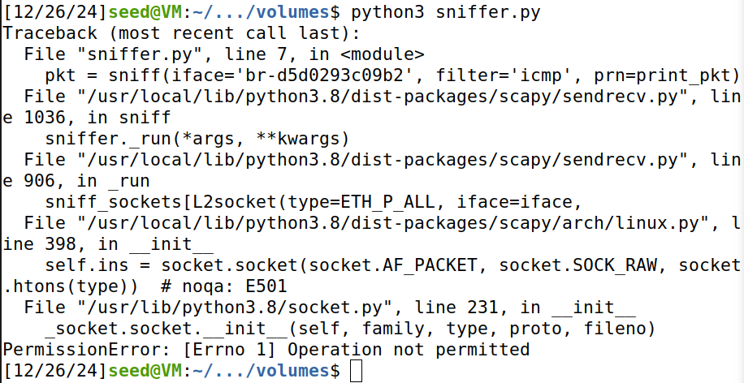

## Environment Setup

Neste Seed Lab, vamos utilizar 3 containers ligados na mesma LAN. 1 vai ser usado para fazer os ataques e os outros 2 serão máquinas do utilizador comum:

Para isso, construímos a imagem Docker:

E corremos os containers referidos dentro dela:

De seguida, de forma a conseguirmos escrever o programa para atacar a rede, precisamos de saber o ID dessa rede criada pelo Docker. Para isso, executamos o comando “ifconfig”:

## Task 1.1A

Nesta task, vamos usar o Scapy para fazer sniffing a packets num programa em Python “sniffer.py”:

Nesse programa, é definida uma função print\_pkt() que é invocada sempre que um packet é capturado, imprimindo algumas informações sobre ele:

Antes de o executar, precisamos de mudar o valor da interface para o valor capturado anteriormente no “ifconfig”:

Como vamos ter que executar o programa com privilégio de root, mudamos para a shell de root:

Tornamos o programa executável:

E executá-mo-lo:

Para testá-lo, vamos enviar packets de um container para outro. Para isso, abrimos a shell do container do hostA:

E demos “ping” ao hostB:

Como esperado, o programa imprimiu informações sobre os packets capturados:

Este packet tem 4 camadas principais:

* **Camada de enlace (link layer) \[Ethernet\]:**  
  * Camada responsável pela comunicação entre dispositivos conectados na mesma LAN. A mesma tem os campos:  
    * **dst:** O endereço MAC do dispositivo de destino (que recebeu o packet);  
    * **src:** O endereço MAC do dispositivo de origem (que enviou o packet);  
    * **type:** O protocolo da camada (neste caso o protocolo é o IP \- Internet Protocol \- na versão 4).  
* **Camada de Internet (internet layer) \[IP\]:**  
  * Camada responsável pelo envio de pacotes entre redes diferentes. A mesma tem os campos:  
    * **version:** A versão do IP (como mencionada anteriormente, é a 4);  
    * **ihl:** Tamanho do cabeçalho IP numa escala de 32 bits (5 indica que o cabeçalho tem 5 \* 32 \= 160 bits, ou seja, 160 / 8 \= 20 bytes);  
    * **tos:** Serviço usado (0 indica que nenhum é usado);  
    * **len:** Tamanho total do pacote (cabeçalho \+ dados);  
    * **id:** ID do pacote;  
    * **flags:** Indicações para o dispositivo de destino sobre o que deve ou não fazer ao pacote (DF indica que não deve ser fragmentado);  
    * **frag:** Indica se o pacote está fragmentado ou não (0 indica que não);  
    * **ttl:** Número de saltos que um pacote pode fazer antes de ser descartado (64 indica que o pacote pode passar por, no máximo, 64 dispositivos, como routers e bridges);  
    * **proto:** Protocolo da camada de Internet (ICMP neste caso);  
    * **chksum:** Valor que ajuda a detetar erros no cabeçalho do pacote IP;  
    * **src:** Indica o IP do dispositivo de origem (10.9.0.5 \- hostA);  
    * **dst:** Indica o IP do dispositivo de destino (10.9.0.6 \- hostB).  
* **Camada de transporte (Transport layer) \[ICMP\]:**  
  * Esta camada é responsável por garantir que um pacote chega ao destino sem qualquer problema associado, seja no trajeto, seja na integridade do pacote. A mesma tem os campos:  
    * **type:** Indica o pedido que foi feito (neste caso, echo-request);  
    * **code:** Código associado ao pedido que foi feito (0 \= pedido padrão);  
    * **chksum:** Verifica a existência de erros no cabeçalho ICMP;  
    * **id:** ID do pedido;  
    * **seq:** Número de sequência do pedido, usado para verificar se o mesmo obteve alguma resposta;  
* **Camada da aplicação (Application Layer) \[Raw\]:**  
  * Esta camada é responsável por fazer uma aplicação interagir com os seus dados. A mesma tem o campo:  
    * **load:** Indica o conteúdo do pacote (neste caso, o conteúdo é aleatório, apenas para efeitos do teste de “ping”).

Agora, vamos experimentar executar o programa sem privilégio de root, para ver se continua a capturar os packets.

Voltamos para a shell seed:

E, ao tentar executar novamente o programa, deu erro de permissão:

## Task 1.1B

Nesta tarefa, vamos filtrar os pacotes capturados, apenas para serem impressos os pacotes que nos interessam.

No Scapy, a filtragem é feita usando a sintaxe de BPF (Berkeley Packet Filter).

Usando essa sintaxe, começamos por capturar apenas os pacotes ICMP (esse filtro já veio com o código, então nenhuma alteração foi feita):

O próximo filtro é capturar os pacotes TCP que vêm de um certo IP (neste caso, 10.9.0.5 do hostA), com destino à porta 23 do dispositivo de destino.

Mudamos o filtro no script de Python:

De forma a enviar pacotes TCP para a porta série 23, para testar o filtro, usamos o Netcat, já usado em Seed Labs anteriores:

E, como esperado, o programa imprimiu informações desses pacotes:

Por fim, o último filtro é capturar os pacotes vindos de e para uma subnet (exceto a da própria VM).

Decidimos escolher a subnet associada a “enp0s3”, **10.0.2.15/24**:

Mudamos novamente o script de Python para aplicar o filtro:

**Nota:** O último valor é 0 e não 15, porque a sintaxe do filtro assim o exige (não afeta o teste, porque apenas os primeiros 3 octetos correspondem à rede).

E, ao testar com pacotes ICMP (comando “ping”), o programa imprimiu as informações:

No sentido inverso também foi impressa (a resposta ao pedido anterior):

Os packets TCP também foram capturados:

## Task 1.2

Nesta task, vamos usar o Wireshark para capturar ICMP packets vindos de um IP aleatório.

Para isso, mudamos o nosso script de Python para gerar o IP e o packet aleatórios:

E definimos o Source IP para um valor aleatório e o IP de destino do packet para o container hostA, para que o Wireshark possa capturar esses packets.

Abrimos o Wireshark como root:

E, ao executarmos o programa, o Wireshark captou os packets:

## Task 1.3

Nesta task, o objetivo é usar o Scapy para estimar a distância, em número de routers, entre a VM e um destino aleatório.

Para isso, vamos inicializar o campo TTL (Time-To-Live), já explicado anteriormente, para 1, incrementando progressivamente o seu valor até chegar ao destino.

Portanto, no nosso script de Python, fizemos um while-loop que vai incrementando o ttl até chegar ao IP pretendido (escolhemos o IP 8.8.8.8, como descrito no enunciado do Moodle):

E, ao correr o programa, verificamos que foram necessários 13 saltos para chegar a esse IP:  
(...)

(...) \-\> há conteúdo para trás que segue o mesmo padrão.

## Task 1.4

Nesta task, o objetivo é combinar os conceitos aplicados nas tasks anteriores e sniffar packets para endereços IP aleatórios. Mesmo que esses IP’s não existam, ou seja, não representam nenhum host, tanto na LAN como na própria Internet, a ideia é dar spoofing para gerar um packet de echo-reply e enviá-lo de volta como resposta, fingindo que foi esse IP que a enviou.

No caso do primeiro IP, 1.2.3.4, apesar do mesmo não existir na Internet, nós vamos conseguir ter respostas deles, pois ele está mapeado na rede, tendo uma route associada.

Apenas precisamos de descobrir como os alcançar. Podemos fazer isso consultando a routing table da rede, através do comando **ip route get \<IP\>:**

Através deste output, sabemos que existe uma route através da gateway 10.0.2.2, onde o IP de origem é o IP 10.0.2.15, da interface “enp0s3”.

Portanto, o que temos de fazer é dar sniffing a um packet com IP de origem 10.0.2.15 e destino 1.2.3.4, e depois manipulá-lo (spoofing), invertendo os IP’s mencionados para enviar uma resposta forjada de volta.

Para esse efeito, reimplementamos o nosso script de Python que usamos ao longo deste Seed Lab:

E, ao darmos “ping” para 1.2.3.4, vimos que o spoofing foi bem-sucedido (manipulamos echo-reply’s desse IP):

De seguida, testamos para 10.9.0.99, que, como o IP não existe na LAN, não pôde ser alcançado:

Por fim, testamos para o IP 8.8.8.8 (já usado na task 1.3), que existe na Internet, e também conseguimos forjar os packets de echo-reply:

Concluímos, desta forma, este Seed Lab.
