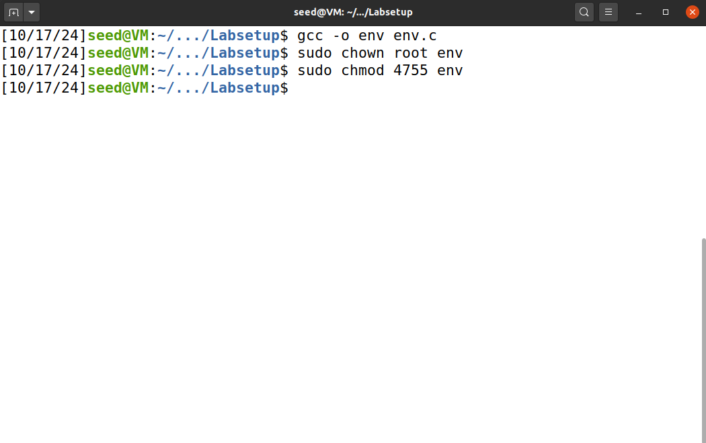

# Environment Variable and Set-UID Lab

## Questão 1:

### Task 1:

#### Nesta task, usamos os comandos usados para imprimir, ativar e desativar variáveis de ambiente.

#### Começamos por testar o comando “printenv”, que imprime as variáveis de ambiente disponíveis: 

### 

#### De seguida, usamos o comando “export” para criar uma nova variável de ambiente:

### ![image2]

#### E o comando “unset” para a apagar:

### ![image3]

### Task 2: 

#### Nesta task, vamos analisar se as variáveis de ambiente de um processo-pai são herdadas pelo seu respetivo processo-filho.

#### Step 1: Começamos por compilar e executar o programa myprintenv.c, salvando o output num ficheiro “file.txt”.

# ![image4]

#### O programa gerou, em formato de texto, as variáveis de ambiente disponíveis:

# ![image5]

#### Step 2: De seguida, colocamos um comentário na função printenv() do processo-filho e tiramos o comentário já colocado na função printenv() do processo-pai, a fim de averiguar se o processo-filho herdava as mesmas variáveis de ambiente do processo-pai:

# ![image6]

#### Compilamos novamente o código e executamos, salvando o output noutro ficheiro de texto, desta vez chamado “file2.txt”.

# ![image7]

#### Ao abrir o ficheiro “file2.txt”, deparámo-nos com um output aparentemente igual ao anterior:

# ![image8]

#### Step 3: De seguida, de forma a ter a certeza de que o output era mesmo igual, usamos o comando diff para comparar os dois ficheiros txt onde os outputs estavam armazenados:

# ![image9]

#### Desta forma, como não há diferença entre os dois ficheiros, chegamos à conclusão de que o processo-filho herda as variáveis de ambiente do processo-pai.

### Task 3:

Nesta task, vamos analisar a forma como a função execve() afeta as variáveis de ambiente de um processo.

#### Step 1: Começamos por compilar e executar o programa myenv.c, que imprime as variáveis de ambiente do seu processo:

# ![image10]

#### O output é vazio, pelo que podemos constatar que não existe nenhuma variável de ambiente associada a este processo.

#### Step 2: De seguida, mudamos o valor do 3º argumento da função execve(), de NULL para a variável externa “environ”:

# ![image11]

#### Step 3: Ao executar novamente o programa com a alteração anterior:

# ![image12]

Observamos que as variáveis de ambiente estão associadas ao processo. Isso significa que o programa obtém as variáveis de ambiente a partir da variável “environ”.

### Task 4:

Nesta task, vemos como a função system() afeta as variáveis de ambiente.

Começamos por colocar o código-fonte num ficheiro system.c:  
![image13]  
De seguida, compilamos e executamos o programa:  
![image14]  
Desta forma, concluímos que as variáveis de ambiente são, sim, passadas para o novo programa /bin/sh, ao utilizar a função system().

### Task 5:

Nesta task, vamos verificar se as variáveis de ambiente são herdadas pelo processo do prorgrama SET-UID, a partir do processo do utilizador.

#### Step 1: Começamos por guardar o código num ficheiro “env.c”:

![image15]

#### Step 2: De seguida, compilamos o programa, colocámo-lo na propriedade do root e ativamos o SET-UID para o mesmo, de forma a que ele seja executado por qualquer utilizador com as permissões do seu proprietário:

![image16]

#### Step 3: Usamos o comando “export” para definir 3 novas variáveis de ambiente:

![image17]  
Ao executar o programa,  
![image18]  
(...)  
![image19]  
(...)

Verificamos que apenas a variável LD\_LIBRARY\_PATH não foi herdada, algo que não esperávamos, já que prevíamos que todas as variáveis fossem herdadas.

### Task 6:

### Começamos por guardar o código num ficheiro “setUID.c”:

![image20]  
De seguida, criamos um programa “malicioso” com o nome “ls.c”:  
![image21]  
Geramos o executável “malicioso”:  
![image22]  
Para fazer o programa chamar o “ls” que nós criamos e não o default, alterámos o PATH para o diretório do programa “malicioso”, colocando o nosso “ls” com maior prioridade:  
![image23]  
Compilamos o setUID.c: ![][image24]  
![image25]  
Trocamos para a shell sem protocolo de segurança contra SET-UID:  
![image26]  
E executámos o setUID.c, e o resultado foi o esperado: foi executado o nosso “ls” malicioso e não o do Sistema Operativo:

![image27]

## Questão 2:

### Task 8:

Nesta task, vamo-nos colocar no lugar do Bob e tentar superar a restrição imposta pelo Vance.

#### Step 1:

Começamos por criar um ficheiro que só o root tem permissões para apagar, com o SET-UID ativo:  
![image28]  
Depois, compilamos o programa para o atacar e torná-lo num SET-UID com o root proprietário:  
![image29]  
Como podemos ver não temos permissões para remover o ficheiro:  
![image30]  
De forma a conseguirmos apagar o ficheiro, usamos a técnica de injeção de comandos. Executamos o programa original e injetamos como string no argv\[1\] o ficheiro que vai ser impresso, mas também um comando a ser executado logo de seguida, que consegue remover o programa, aproveitando-se do facto de, durante a execução de “catall”, com o SET-UID ativo, o utilizador “seed” tem permissão temporária, mas suficiente, para remover o ficheiro-alvo (target.txt).  
![image31]
