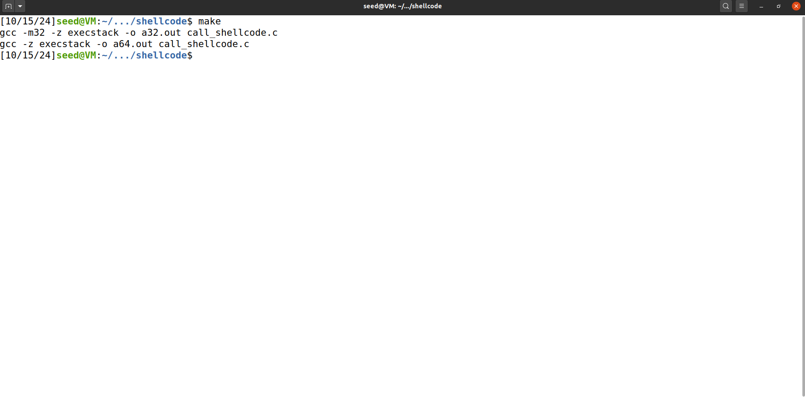

# Buffer Overflow Attack Lab (Set-UID Version)

### Environment Setup

Em primeiro lugar, tivemos que preparar o ambiente para o Seed Lab, começando por desativar a funcionalidade de randomização do endereço de stacks e heaps.

Configuração da Shell

Como em versões recentes do Ubuntu, tanto o dash como o bash possuem medidas de segurança contra processos Set-UID, tivemos que mudar a shell que vamos usar neste seed lab, para a shell zsh, ou seja, fazer bin/sh apontar para bin/zsh.

## Questão 1

### Task 1

Começamos por compilar o código que invoca a shellcode, através do comando make, que gera duas cópias do shellcode, em 32 e 64 bits.  

Ao correr os programas, eles abrem uma nova shell, a zsh referida anteriormente:

### Task 2

Começamos por editar a variável L1 da Makefile para 100+8\*7 \= 156\.

De seguida, compilamos o programa stack.c, desativando o protocolo StackGuard (através da flag \-fno-stack-protector) e ativando a permissão de execução de código presente na stack (através da flag \-z execstack). Além disso, mudamos a propriedade do programa para “root” e a permissão para 4755\.  
Como os comandos estão inseridos na Makefile, executamos a seguinte instrução, especificando apenas o target no argv\[1\], que vai definir o BUF\_SIZE.

### Task 3

Começamos por criar o ficheiro badfile:

Usamos o binário do debugger para dar debug ao stack-L1-dbg:

Criamos um breakpoint na função bof():

Corremos o programa até ao breakpoint:  

No ponto em que o gdb parou dentro da função bof(), o frame pointer (registo ebp) ainda está a apontar para a stack frame da função que chamou bof(). Para fazer com que o frame pointer atualize o seu apontador para a função bof(), devemos executar algumas instruções inseridas na função, e fazemos isso no terminal através do comando next:  

Agora que o frame pointer aponta para o stack frame correto, podemos obter os valores que pretendemos. Em primeiro lugar, vamos imprimir o seu valor para saber o endereço da stack frame:  

E agora, o endereço do buffer:  

Agora que temos os endereços necessários para realizar o ataque, temos que escrever no badfile o conteúdo que vai ser inserido no buffer, que vai ser o shellcode e o seu return address, juntamente com NOP’s de preenchimento. Para isso, usamos o programa exploit.py já pré-fornecido, e fazemos algumas alterações para o adaptar para esta situação.

Em primeiro lugar, alterámos o valor da variável shellcode, que contém o “código maligno” que vai abrir uma shell com privilégios de root. Já que o programa-alvo está a usar a versão em 32 bits, o valor da shellcode será o mesmo colocado na diretiva \#else em call\_shellcode.c:

A próxima variável a alterar em exploit.py é a start, que representa a posição no array content onde vamos começar a inserir o shellcode. De forma a colocar o shellcode no final do buffer:  

O próximo passo é mudar os valores das variáveis ret e offset, que representam, respetivamente, o return address (que deve apontar para o shellcode) e o offset (distância entre o buffer e o return address). O return address será o endereço do buffer mais o start, de forma a que aponte para o começo do shellcode no array. Já o offset é a distância entre o início do buffer e o frame pointer (ebp) mais 4, já que o frame pointer tem 4 bytes numa arquitetura de 32 bits. Por esse mesmo motivo, o L é 4 (já que o return address também vai ter 4 bytes e queremos fazer uma sobrescrição) e preenche-se o lugar do return address original no array com o novo return address:   

Executamos o programa:  

E, ao correr o programa vulnerável, a shell com privilégio root foi lançada, como previsto:  

## Questão 2

Vamos então, por via de debug, visualizar a parte da memória afetada por este ataque.  
Começamos por correr o programa em gdb (debug):  

Assim como na Task 3, definimos um breakpoint na função bof():  

Executamos até ao breakpoint:  

Demos 2 “next’s” para colocar o valor do frame pointer na função atual:  

E vamos averiguar os valores colocados no buffer, que são os esperados:   

(O restante é tudo 0x00)

Como podemos ver na imagem acima, o buffer está todo preenchido com NOP (0x90) até ao local onde o return address foi armazenado. O return address, devido à diferença de endereços entre quando o programa corre na shell e quando corre no gdb, aponta para um endereço um pouco atrás do do shellcode, que não afeta o funcionamento do ataque, já que esse intervalo está preenchido com NOP também. Também se verifica que o shellcode foi bem lido e armazenado no buffer, pois os valores batem quando lidos da direita para a esquerda.
