# Format-String Vulnerability Lab

### Environment Setup

Em primeiro lugar, desativamos a randomização de endereços:

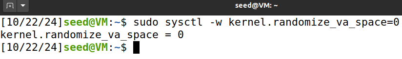

O nosso programa-alvo vai ser o programa format.c, que tem uma vulnerabilidade de format string.

Vamos compilá-lo em 32 e 64 bits, usando a Makefile (comando make)

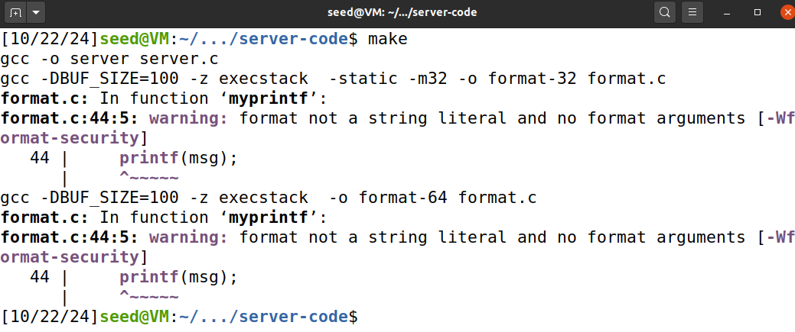

De seguida, copiamos o binário para a pasta fmt-containers, para ser usado pelos containers em Docker:

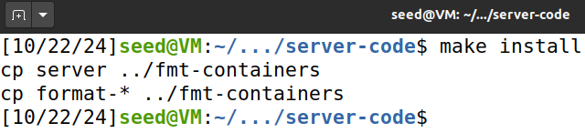

Vamos usar o Docker para construir um servidor local que vai ser alvo do nosso ataque. Começamos por construir a imagem Docker:

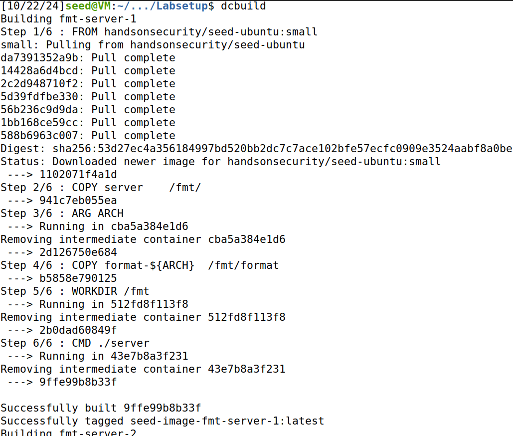

Por fim, executamos os containers a partir da imagem construída, criando o servidor:

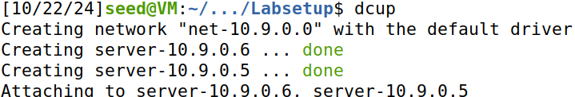

## Questão 1

### Task 1

Nesta task, vamos usar o servidor com o IP 10.9.0.5, que executa um programa de 32 bits com a vulnerabilidade mencionada acima. 

A port usada para o envio de inputs para o servidor será a 9090\.

O nosso objetivo será crashar o programa que é executado em background no servidor.

Começamos por enviar uma mensagem benigna, para fins de teste, apenas imprimindo “hello”:  

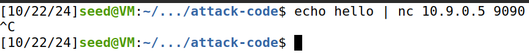

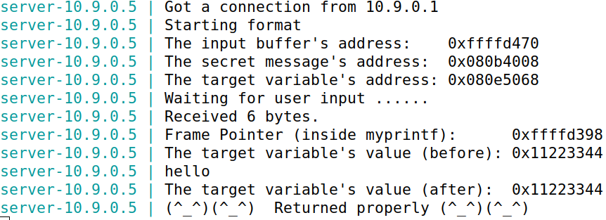

Note-se que, para obter o output da imagem acima, tivemos que abortar o comando dado, já que, como o Netcat (nc) não recebeu um sinal EOF (end of file) para encerrar a entrada, ele estava à espera de receber mais dados.

De modo a crashar o programa, apenas precisamos de enviar o especificador de formato “%s”, que, como é impresso sozinho, sem nenhum argumento correspondente, vai tentar imprimir uma string armazenada num endereço aleatório. Como esse endereço não possui uma string armazenada nele, o programa crasha.  

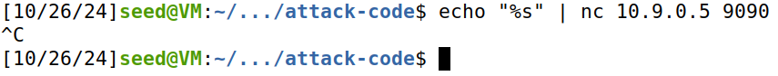

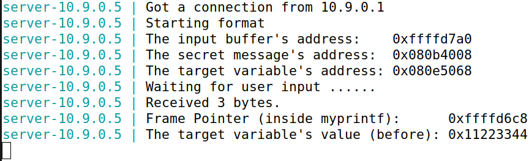  

Podemos concluir que o programa crashou, pois não aparece impresso neste output “Returned properly”.

### Task 2A

Nesta task, vamos imprimir dados presentes na stack. Para isso, fornecemos um input e vamos imprimir os seus primeiros 4 bytes. Para facilitar a leitura, usamos um valor conhecido, a string “FEUP”.

Para facilitar a construção da format string, usamos o ficheiro build\_string.py.

Em primeiro lugar, colocamos no início do buffer o nosso input. Para isso, usamos o número hexadecimal 0x50554546 que, em little-endian, representa a string “FEUP”:  

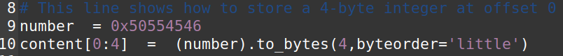

De seguida, concatenamos uma string cheia de “%.8x” (de forma a imprimir os valores presentes na stack em formato hexadecimal com, no mínimo, 8 dígitos), colocamos à direita de “number” no buffer e escrevemos o array “content” no badfile:  

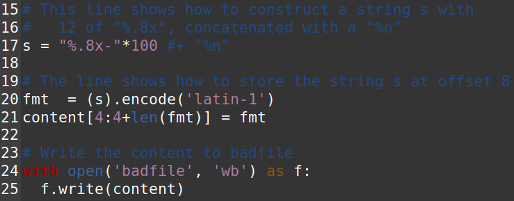

Executamos o programa para o badfile ser escrito:  

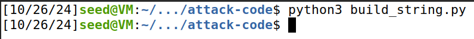

Por fim, mandamos o conteúdo do badfile como input para o servidor:  

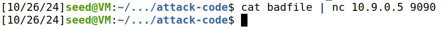

Este foi o output do servidor:  

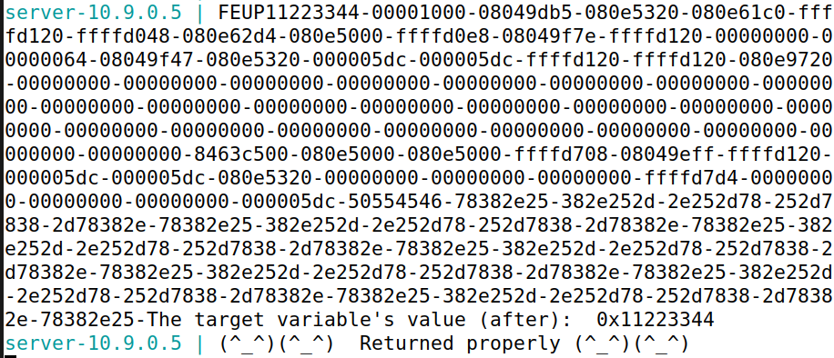

Como podemos ver, estão impressos a string “FEUP” e o seu valor em hexadecimal, mais ou menos no centro da imagem.

Ao fazermos a contagem, verificamos que existem 63 octetos entre “FEUP” e os seus primeiros 4 bytes, armazenados no início do buffer. Logo, para imprimir os primeiros 4 bytes de um input, são precisos concatenar exatamente 64 “%x” na format string que vai ser inserida no buffer.

### Task 2B

Nesta task, vamos imprimir uma mensagem secreta armazenada na heap.

O endereço da mesma é fornecido no output do servidor e é este:  

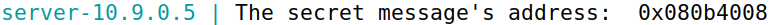

De forma a completar o objetivo, devemos colocar esse endereço na variável number:  

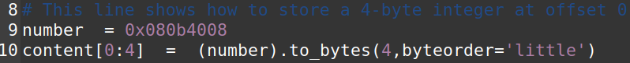

Como já visto na task anterior, existem 63 octetos entre o input e os seus bytes. Logo, concatenamos 63 “%x” à format string para chegar ao endereço da stack imediatamente antes do início do buffer, e os primeiros 4 bytes do buffer contêm como valor hexadecimal o endereço que contém a secret message. Como queremos ver a string armazenada nesse endereço, concatenamos um “%s” no fim:  

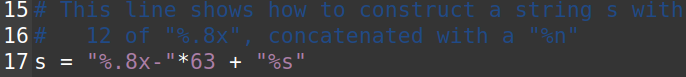

Mandamos novamente o ficheiro como input para o server:  

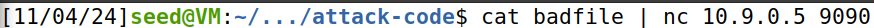

E o server imprimiu isto:  

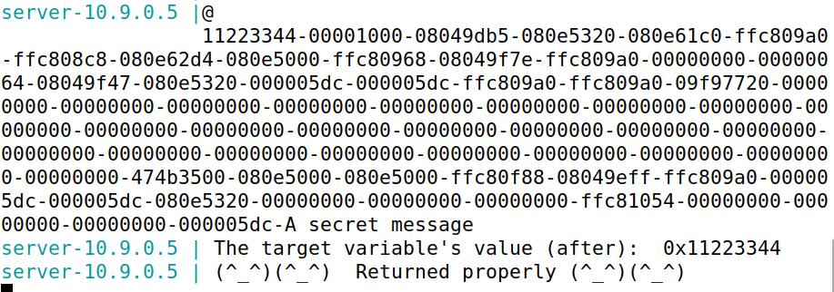

Através do output do servidor, podemos concluir que a secret message era “A secret message”.

### Task 3A (menos a Task 3C)

Nesta task, vamos mudar o valor da variável “target”, definida no programa do servidor (format.c), para outro valor, que, nesta task em específico, pode ser qualquer um diferente do atual.

Endereço da variável:  

Mudamos a variável number para o endereço da “target”:  

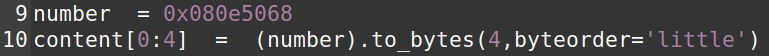

E, como desta vez queremos escrever num endereço e não ler o seu conteúdo, concatenamos “%n” ao invés de “%s”. Este especificador de formato escreve no endereço do argumento passado o número de caracteres escritos até ao próprio. Como o valor é praticamente aleatório, apenas trocamos o “%s” por “%n”:  

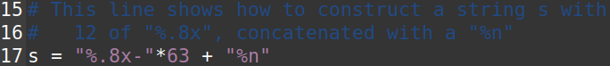

Esta foi a resposta do servidor:  

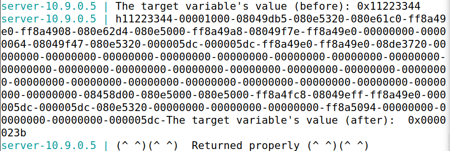

Como podemos ver, o valor da variável “target” foi alterado.

### Task 3B:

Nesta task, vamos mudar o valor da mesma variável “target”, mas especificamente para 0x5000, que em decimal é 20480\.

Sabendo que “%n” representa o número de caracteres escritos atrás dele, precisamos de escrever 20480 caracteres mantendo o “%n” associado ao endereço de “target”. 

O método que utilizamos foi o de ler o endereço afetado pelo primeiro “%x” com dígitos extra de preenchimento, lendo os restantes da mesma forma e acrescentando o “%n” no final.

Para calcular esse offset (quantos dígitos o primeiro “%x” ia ter), fizemos o seguinte cálculo:

O \= 20480 \- 4 \- 62 \* 9 \= 19918

O \-\> offset  
20480 \-\> número de caracteres antes do “%n”  
4 \-\> 4 bytes do endereço de “target”, armazenado no início do buffer (produzem 4 caracteres na saída)  
62 \-\> como o primeiro endereço já vai ser lido na extensão de dígitos, só vamos ter que ler mais 62 octetos  
9 \-\> “%.8x-” produz 9 caracteres na saída (8 dígitos \+ o caracter “-”)

Chegamos, deste modo, à conclusão de que a nova format string que vai ser concatenada ao endereço de “target” é esta:  

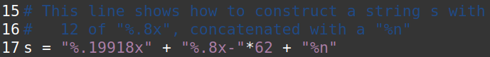

Compilámos e enviamos como input para o servidor o novo código:  

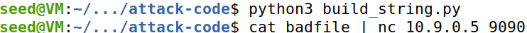

E o output do servidor confirmou que o nosso raciocínio estava certo:  
(...)  

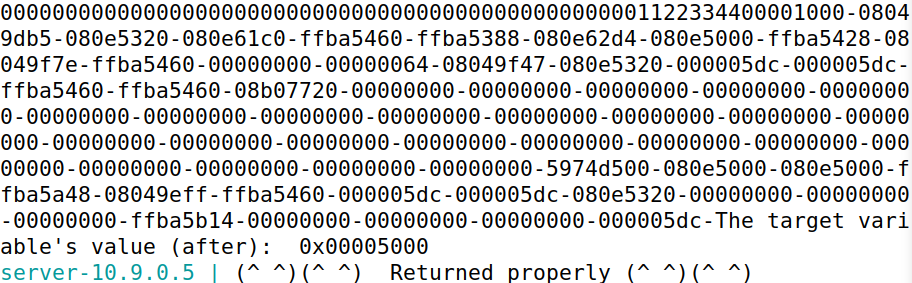

(o restante é tudo 0000…)  
O novo valor de “target” é 0x5000, como a tarefa pedia.

## Questão 2:

O CWE-134 refere que, quando o input de uma função de formatação não é sanitizado ou validado, um invasor pode injetar uma format string que lhe permite ler e/ou escrever na memória do programa, incluindo a stack. Ao ser armazenada na stack, a string formatada pode possibilitar, por exemplo, a execução de código malicioso, já que dados e endereços importantes seriam acessíveis ao atacante.

Porém, o facto de a format string ser alocada noutro local que não a stack (por exemplo, a heap) **não** impossibilita que outras vulnerabilidades possam ser exploradas.

Por exemplo, considerando as tarefas realizadas anteriormente, **os ataques das tasks 2A, 3A e 3B deixariam de funcionar se a format string estivesse alocada na heap** (apenas num cenário em que a stack contivesse um pointer para a heap é que os ataques ainda poderiam funcionar, já que permitiria que a format string alocada na heap pudesse ser aplicada na stack, afetando os seus dados). Os outros ataques das outras tasks permaneceriam funcionais.

Os ataques referidos não funcionariam neste contexto, pois na task 2A fazemos uma leitura dos dados presentes na stack e nas tasks 3A e 3B escrevemos nela. Se a format string, que faz essas operações acontecerem, estiver alocada atrás, na heap, é impossível a stack ter acesso a ela (sem um pointer para lá, que, no contexto destas tasks, não é configurado), impossibilitando a ocorrência dessas operações e, consequentemente, o ataque, que depende da realização correta das mesmas.
