## Environment Setup

Em primeiro lugar, definimos os hosts para este Seed Lab na VM:

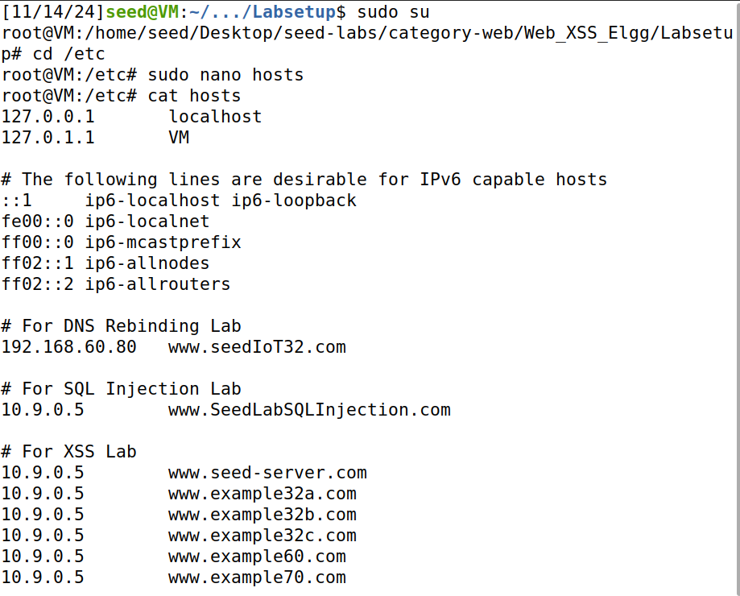

De seguida, construímos a imagem e ligamos os containers:  

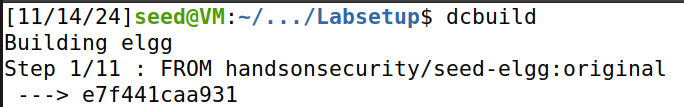

(...)  

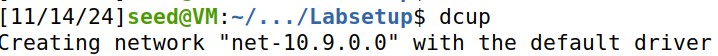

(...)

Noutro terminal, usámos o comando “dockps” para verificar se os containers pretendidos estavam a correr:  

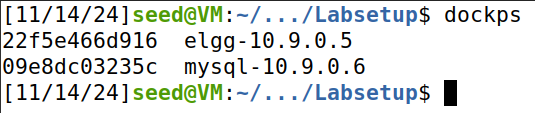

## Questão 1

### Task 1

Nesta task, o objetivo era injetar código JavaScript na descrição (“About Me”) de um perfil Elgg para que, quando o mesmo fosse aberto por outro utilizador, uma janela de pop-up aparecesse com uma mensagem maliciosa.

Para isso, escolhemos utilizar a conta do Samy:  

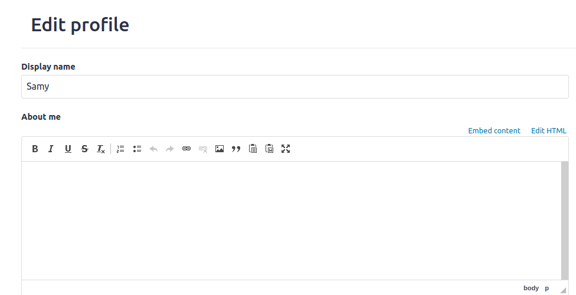

Na aba de editar perfil, clicámos no botão “Edit HTML” e injetámos o script:

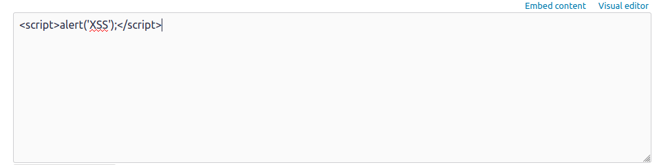

Salvamos as alterações:  

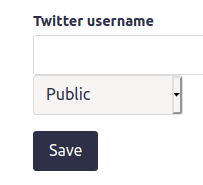

E, ao testar com outra conta (usámos a do Charlie), vimos que o pop-up aparece:  

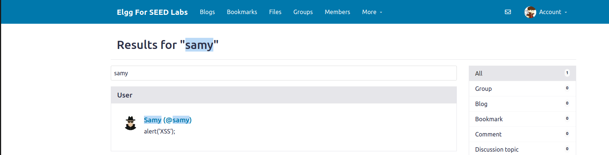

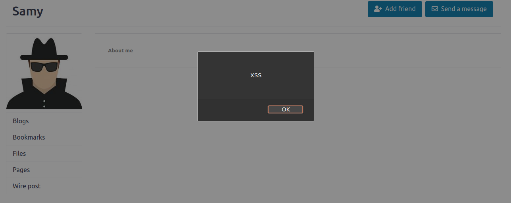

### Task 2

Esta task é muito parecida com a anterior, mas nesta, o pop-up vai mostrar como mensagem os cookies dos utilizadores quando visualizam o perfil do Samy.

Logando novamente na conta do Samy, editámos o HTML no “About Me” e injetámos o script:

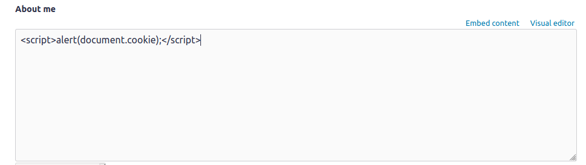

Ao salvar, sempre que outro utilizador visualizava o perfil do Samy, os seus cookies eram expostos:

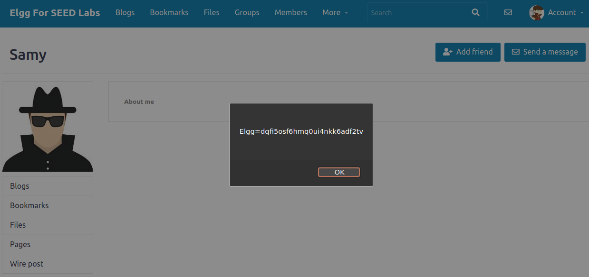

### Task 3

Nesta task, vamos enviar os cookies para o atacante, na porta 5555 do servidor, onde o mesmo usará o Netcat como “port listener”.

Para isso, voltamos a editar o HTML no perfil do Samy:

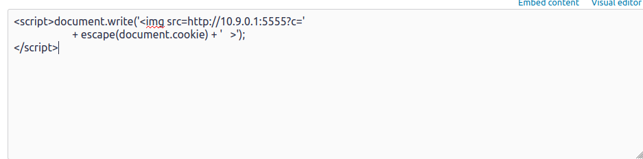

Ao logar com outra conta, o HTTP request é enviado e os cookies são impressos:  

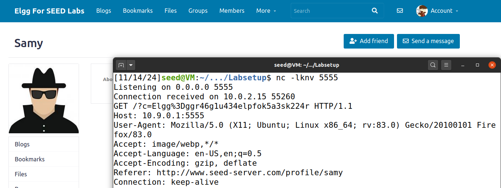

### Task 4

Nesta task, vamos fazer com que o utilizador que entra no perfil do Samy automaticamente o adicione como amigo.

Logo, temos de averiguar o aspeto do HTTP request que é enviado ao servidor quando intencionalmente se adiciona alguém como amigo.

Para isso, vamos usar a ferramenta de inspeção HTTP do Firefox:  

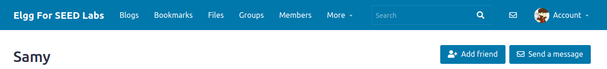

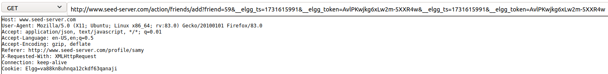

Conseguimos, desta forma, saber o endereço (está localizado ao lado do “GET”).

Com esta informação, conseguimos construir o script malicioso, que vai ser colocado no “About Me” do Samy:  

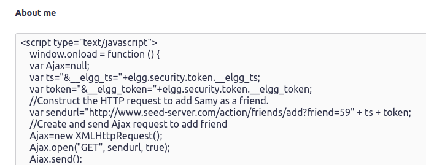

Ao entrar na conta do Boby (que não tinha pedido o Samy em amizade) e acedendo ao perfil do Samy, verificamos que o pedido de amizade foi enviado, apesar de não se ter clicado no botão “Add Friend”:  

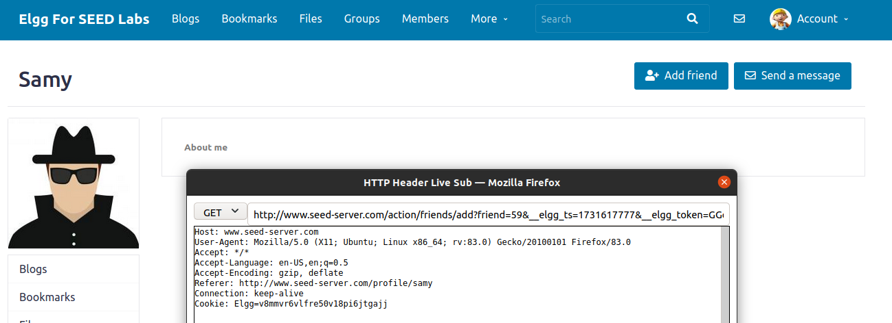

#### Question 1

A variável “ts” (linha 1’) representa o timestamp do HTTP request, ou seja, o momento temporal em que a ação foi realizada. 

A variável “token” (linha 2’) representa o novo token gerado a cada sessão que a identifica, confirmando a autenticidade do utilizador e prevenindo ataques de CSRF.

Elas são necessárias para serem concatenadas ao “sendurl”, junto com o request principal, de forma a tornar o formato do nosso URL compatível com o original, enganando o servidor ao fazê-lo pensar que esse request é legítimo e realmente foi feito intencionalmente pela vítima.

#### Question 2

Se o Elgg apenas fornecesse o modo de Editor, o ataque já **não** funcionaria, já que o modo de Editor interpreta o texto colocado nele de forma literal, não o interpretando como script de código a ser armazenado no servidor e executado quando evocado. Isto acontece, porque o Editor Mode do “About Me” possui proteções contra JavaScript Injection. Se eu tentasse colocar o mesmo script que coloquei no Text Mode lá, o mesmo seria adicionado como texto comum à descrição do perfil.

## Questão 2

Este ataque enquadra-se mais num **Stored XSS**, já que o script malicioso é armazenado (stored) no servidor (neste caso, na secção “About Me” do perfil do Samy) e evocado individualmente em cada browser de cada vítima que abre o perfil do mesmo. Pelo facto do script ser armazenado no server, este ataque não é o habitual das outras modalidades de ataques XSS.
