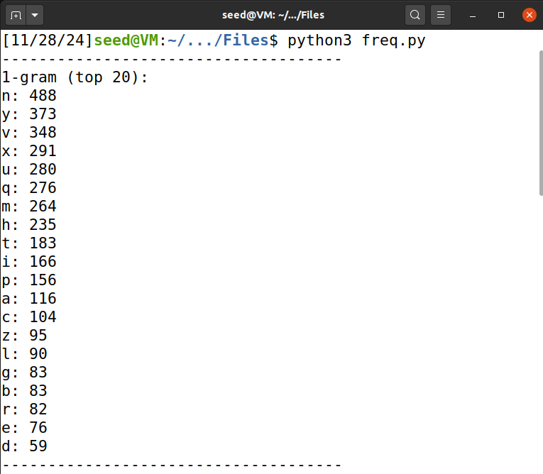
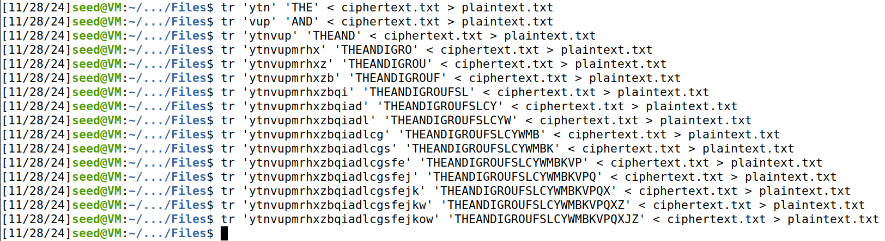

# Secret Key Encryption Lab

## Task 1:

Nesta task, vamos, através da análise da frequência com que letras, em grupos de 1, 2 e 3, aparecem num ficheiro encriptado, decifrá-lo manualmente.

Desta forma, fizemos a análise de frequências do ficheiro “ciphertext.txt”, com o programa “freq.py”:

Para conseguirmos associar as frequências das letras encriptadas às frequências das letras reais, fomos à Wikipedia dos Trigrams e dos Digrams:  

[https://en.wikipedia.org/wiki/Trigram](https://en.wikipedia.org/wiki/Trigram)  

[https://en.wikipedia.org/wiki/Bigram](https://en.wikipedia.org/wiki/Bigram)

Através dos dados presentes, assumimos que “ytn” seria “THE”, já que ambos eram os trigrams mais comuns.

Também assumimos que “vup” seria “AND” pelo mesmo motivo, e por aí fora…

À medida que íamos decifrando as letras, fomos anotando a sua correspondência:

Com isso, fomos decifrando o ficheiro aos poucos:

E, no fim, chegamos ao texto desencriptado:  

## Task 2: 

Nesta task, vamos usar vários algoritmos e modos de encriptação para encriptar um ficheiro de texto gerado por nós.

Começamos por gerar um ficheiro “plaintext.txt” feito a partir de um gerador “Lorem ipsum”:  

[https://www.lipsum.com/feed/html](https://www.lipsum.com/feed/html)

O primeiro modo testado foi o “aes-128-ecb”:

O resultado da encriptação foi este:

Ao executarmos o processo de desencriptação, conseguimos, com sucesso, recuperar o texto original:  

De seguida, testamos o modo “aes-128-cbc”:  

O resultado da encriptação foi este:  

E, ao desencriptar, também conseguimos recuperar o conteúdo original:  

Em último lugar, testamos o modo “aes-128-ctr”:

O comando gerou este ficheiro:  

Novamente, ao desencriptar, conseguimos recuperar o texto original:  

### \- Ao cifrar, que flags teve que especificar? Qual a diferença entre estes diversos modos?

Ao cifrar, tive que especificar as flags:

* **\-ciphertype:** indica o algoritmo e o modo de encriptação/desencriptação;  
* **\-e:** indica que vamos encriptar um ficheiro;  
* **\-in:** indica o ficheiro de input, que vai ser alvo da encriptação;  
* **\-out:** indica o ficheiro de output, que vai conter o conteúdo encriptado;  
* **\-K:** indica a chave em hexadecimal;  
* **\-iv:** indica o vetor de inicialização, também em hex, que vai fornecer maior randomização do processo de encriptação.

Os modos de encriptação mudam a forma como o algoritmo é aplicado. Neste caso, usámos 3 modos diferentes, que possuem diferenças:

* **AES-128-ECB:** A principal diferença do ECB (Electronic Codebook) para os outros modos de AES é que este não usa um IV (vetor de inicialização). Neste modo, cada bloco de 16 bytes (128 bits, daí estar “128” presente na designação do cipher) é cifrado sempre com a mesma chave, sem randomização acrescentada, o que leva a que blocos de texto iguais sejam encriptados da mesma forma, permitindo identificar padrões, o que pode comprometer a segurança dos dados encriptados;

* **AES-128-CBC:** A principal diferença do CBC (Cipher Block Chaining) para os outros modos de AES é que a encriptação de cada bloco do plaintext é diretamente dependente da encriptação do bloco anterior: uma operação de XOR (exclusive-or) é realizada entre o bloco atual e o ciphertext do bloco anterior. Além disso, o IV já é necessário aqui, já que este vai estar envolvido na encriptação do primeiro bloco (já que, nesse caso, não há bloco anterior);

* **AES-128-CTR:** A principal diferença do CTR (Counter) para os outros modos de AES é que um contador é usado para fazer uma encriptação no estilo de CBC, porém, sem dependência entre os blocos. O valor inicial do contador é o IV (já que o contador está a 0 e 0 é o “elemento neutro” do XOR) que, ao ser cifrado, gera uma keystream (um fluxo de bits), que é combinado com o plaintext, mais uma vez através de uma operação de XOR, gerando o ciphertext. De seguida, o contador é incrementado, gerando uma nova keystream, e este procedimento repete-se até ao final do ficheiro.

### \- Ao decifrar, que flags teve que especificar? Qual a diferença principal entre aes-128-ctr e os restantes modos?

Ao decifrar, tive que especificar as flags:

* **\-ciphertype:** indica o algoritmo e o modo de encriptação;  
* **\-d:** indica que vamos desencriptar um ficheiro;  
* **\-in:** indica o ficheiro de input, que vai ser alvo da desencriptação;  
* **\-out:** indica o ficheiro de output, que vai conter o conteúdo desencriptado;  
* **\-K:** indica a chave em hexadecimal;  
* **\-iv:** indica o vetor de inicialização, também em hex, que vai reverter a randomização feita.

A principal diferença entre AES-128-CTR e os restantes modos no contexto de desencriptação é que o CTR desencripta os blocos de forma paralela (tem a capacidade de desencriptar tudo de uma vez), ao contrário do CBC, e possui um algoritmo mais eficiente que o ECB, já que o ECB, apesar de, por padrão, também desencriptar de forma paralela, o mesmo utiliza uma abordagem sequencial para ficheiros grandes, além de que o CTR permite uma encriptação mais segura sem risco de gerarmos um ficheiro que não seja possível decifrar.

## Task 5:

Para cada um dos modos de cifra, estas eram as nossas expectativas:

* **AES-128-ECB:** Por ser um modo independente de bloco, esperamos que apenas o bloco que contém o byte seja afetado (perder-se-iam 16 bytes de informação);

* **AES-128-CBC:** Como este modo é dependente de bloco, esperamos que o bloco que contém o byte e o seguinte sejam afetados (perder-se-iam 32 bytes de informação);

* **AES-128-CTR:** Já que este modo não é sequencial, ou seja, não divide o texto em blocos de 16 bytes (16 chars), esperamos que apenas o próprio byte seja afetado (perder-se-ia 1 byte de informação).

Desta forma, começamos por encriptar em modo ECB:  

De seguida, alterámos o byte 350 (50 \* 7), de 75 para 70 no editor hexadecimal Bless:  

Decifrámos o ficheiro no modo ECB:  

E verificámos que, de facto, o bloco que continha o byte ficou corrompido:  

De seguida, vamos encriptar no modo CBC:  

Alterámos o valor do byte de 84 para 80:  

Demos decrypt:  

E, neste caso, a nossa previsão não foi 100% correta, já que, no segundo bloco, apenas 1 caracter foi afetado, e não o bloco todo (devia estar escrito “primis” e não “pvimis”):  

Por fim, fomos encriptar no modo CTR:  

Mudámos o valor do byte de 77 para 70:  

Demos decrypt:  

E, de facto, o ficheiro teve apenas 1 caracter corrompido (devia estar escrito “Vestibulum” e não “Vestibukum”):

**Nota:** Neste caso, ficamos surpreendidos pelo facto da corrupção não ter sido no mesmo local dos dois modos anteriores…

Concluímos, desta forma, este Seed Lab.
